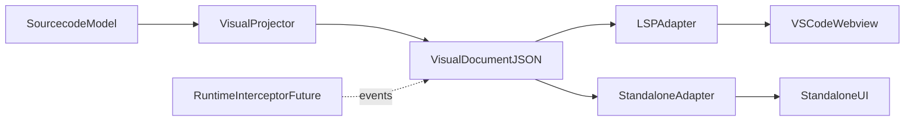

# AST-Level Visual Editor Model Plan

## What we learned (current baseline)

- The current codebase already has a readonly visual layer in VSCode webview built on ReactFlow, fed by LSP `resolve_file`.
- In this worktree there is no `internal/compiler/ast/flowast.go`; the effective source-level model is in `sourcecode` entities.
- Compiler remains editor-agnostic today (good foundation): parser -> analyzer -> irgen -> runtime.

Key anchors:

- [internal/compiler/sourcecode/src.go](internal/compiler/sourcecode/src.go)
- [internal/compiler/parser/listener.go](internal/compiler/parser/listener.go)
- [internal/compiler/parser/listener_helpers.go](internal/compiler/parser/listener_helpers.go)
- [pkg/lsp/resolve_file.go](pkg/lsp/resolve_file.go)
- [web/webview/src/core/file_view_state.ts](web/webview/src/core/file_view_state.ts)
- [web/webview/src/components/editor/helpers/build_graph.ts](web/webview/src/components/editor/helpers/build_graph.ts)
- [internal/runtime/connector.go](internal/runtime/connector.go)

## Target architecture principle

- Keep compiler and runtime free from editor/LSP/UI concerns.
- Introduce a separate **visual-model layer** (pure data projection) between source model and UI hosts.
- Support two hosts from the same contract:
  - VSCode extension (via LSP/custom request)
  - Standalone app (via CLI/API/library call)

## Phase 1 - Canonical visual contract (readonly, AST-level)

### Goal

Define a stable, host-agnostic contract for AST/source visualization.

### Deliverables

- New design doc with schema and mapping rules (no editor dependencies).
- Canonical IDs for all visual entities (stable across refreshes).
- Explicit distinction between:
  - semantic nodes (component/node/const/interface/type)
  - synthetic nodes (e.g., deferred/lock view nodes in visualization only).

### Core contract sections

- `VisualDocument` (workspace/package/file metadata)
- `VisualEntity` (types/interfaces/const/components)
- `VisualComponentGraph` (nodes, ports, edges, annotations)
- `VisualNodeRef` (entity ref + resolved interface snapshot)
- `VisualEdgeRef` (sender/receiver + selectors + source range)
- `VisualMeta` (source ranges, raw text, diagnostics tags)

### Source mapping rules (from current model)

- `sourcecode.Component.Nodes` -> visual graph nodes.
- `sourcecode.Component.Net` -> visual edges.
- `PortAddr.Meta`/`EntityRef.Meta` -> source anchors for click-to-text navigation.
- `TypeExpr.Meta.Text` -> compact type badges/tooltips.

## Phase 2 - Multi-scope UX model (consider all options)

### Goal

Support package-first, file-first, and hybrid views without locking architecture early.

### Decision-gated model

- `Scope = Package | File | Component` in view state.
- Same VisualDocument; different filtered/projection views.
- Add objective comparison criteria:
  - graph size/readability
  - navigation friction
  - cross-file reference clarity
  - performance in large packages

### UX structure

- Package canvas as primary exploratory mode.
- File focus mode as filtered lens.
- Component drilldown mode for dense nets.
- Keep breadcrumbs + minimap + "reveal in source" action.

## Phase 3 - Readonly MVP stabilization in VSCode

### Goal

Replace ad-hoc webview graph building with canonical visual projection path.

### Work packages

- LSP API extension: add dedicated visual payload endpoint (or evolve `resolve_file` with versioned schema).
- Webview uses only canonical visual contract.
- Deterministic layout grouping policy for AST semantics (not by UI node type only).
- Add source-sync affordances:
  - click node/edge -> jump to source range
  - hover highlights adjacency + source snippet

### Non-goals in MVP

- direct graph editing
- write-back to source
- runtime debugger UI

## Phase 4 - Format adapters (DOT, Mermaid, ThreeJS bridge)

### Goal

Use export adapters for sharing/debugging and future rendering experiments, while preserving canonical model.

### Adapter strategy

- `VisualDocument -> DOT` for precise graph tooling and port-address fidelity.
- `VisualDocument -> Mermaid` for docs/discussions/PRs (best-effort; limited port semantics).
- `VisualDocument -> 3D scene model` for future standalone exploration (optional, not default path).

### Practical constraints

- DOT is best for strict port-level addressing and subgraphs.
- Mermaid is ideal for communication, weaker for exact round-trip semantics.
- 3D should be treated as presentation layer experiment, not canonical editor model.

## Phase 5 - Debugger-ready extension points (no debugger implementation yet)

### Goal

Reserve integration seams for future hybrid text/visual debugging via runtime interceptor.

### Extension points

- Add optional event envelope in visual contract (`eventType`, `sender`, `receiver`, `timestamp`, `messageType`).
- Map runtime `MessageSent/Pending/Received` concepts to edge-level overlays.
- Keep this behind capability flags so readonly AST viewer remains independent.

## Phase 6 - Standalone parity path

### Goal

Ensure host-neutral architecture by reusing same visual model outside VSCode.

### Work packages

- Provide standalone transport (HTTP/CLI/file JSON).
- Keep UI state (selection, viewport, panels) host-local and non-canonical.
- Reuse same renderer core with host adapters.

## Risks and mitigations

- Missing `flowast.go` drift risk: lock plan to actual active model in `sourcecode` now, and keep naming adaptable for future AST package refactor.
- Over-coupling to VSCode request shape: introduce versioned visual schema contract early.
- Graph density explosion at package scope: enforce progressive disclosure (collapse groups, component drilldown).
- Debugger pressure too early: capability flags + strict readonly baseline first.

## Reference-informed UX ideas to evaluate

- Grouping/subflow patterns (Node-RED style) for component encapsulation and navigation.
- Sticky-note/annotation layer (n8n/Node-RED style) for comments and design intent.
- Breakpoint/watch vocabulary from graph tools (Blueprint-style) as future overlay only.
- Message/debug side panel model (Node-RED debug sidebar analogue) for interceptor events in later phases.
