# Language Simplification

## Problem

The language keeps getting more complex as new features are added, which delays the development of a visual editor. This raises a question: are we stuck in a trap? Perhaps the key to success is to simplify the language by removing unnecessary abstractions and their combinations. This would:
- Make visualization simpler
- Make the textual representation more verbose, but this would be compensated by the visual editor

## Difference between IR and Desugared Program

**IR (Intermediate Representation)** — a low-level representation between source code and runtime. Developers cannot (and should not) write IR directly. We have a dot backend for visualizing IR.

**Desugared Program** — a program without syntactic sugar that developers could theoretically write by hand (but don't want to due to low readability). Examples: ErrGuard and ChainConnection can be expressed manually, but this adds noise.

## Feature Visualization

### Easy to Visualize

- *FanIn/FanOut* (`[...] -> ...` and `... -> [...]`, desugared into `fan_in/fan_out` nodes and connections, visualizes without any problems)
- *ErrGuard* (`some_node SomeNode?` — doesn't affect network visualization complexity because it simply removes the extra connection `some_node:err -> :err`)
- *ChainConnection* (`foo -> bar -> baz` instead of `foo:a -> bar:b -> baz:c`, implicit port substitution doesn't harm visualization)
- *Const* (`foo -> $bar -> ...`)
- *Struct Selector* (currently only supported inside chained connections e.g. `foo -> .bar -> baz` but not `foo.bar -> baz`)

### Features That Raise Concerns

- *Range* (range syntax is problematic for extracting entities `type stream` and `def Range` into the `streams` package, as the compiler becomes forced to know about this package; see PR https://github.com/nevalang/neva/pull/926 and issue https://github.com/nevalang/neva/issues/924)
- *Unary/Binary/Ternary Expressions* (expressed as regular nodes+connections, but creates a lot of noise in text)
- *Union Sender*
    - Tag-only - `Type::Member -> ...` by itself doesn't seem to cause problems (especially in chained form `... -> Type::Member -> ...`, not yet implemented at the time of writing this document)
    - Tag and Data - `Type::Member(wrapped_sender) -> ...`, problems begin here because we reference another sender (network sender) in a "non-standard" (for dataflow) way, i.e., without an _explicit_ connection to the receiver (tagged union wrapper)
- *Deferred Connection* - generally an ambiguous feature (in https://github.com/nevalang/neva/issues/717#issue-2565619530 the possibility of its removal was considered, but without sufficient justification)
- *Switch* - both in its current implementation and in the "Routers and Selectors" proposal
  - `if` https://github.com/nevalang/neva/issues/802 (not implemented, partially emulated by current `switch`)
  - `switch` https://github.com/nevalang/neva/issues/804 (partially implemented)
  - `match` https://github.com/nevalang/neva/issues/805 (partially implemented as component, runtime function, without language-level feature support)
  - `select` https://github.com/nevalang/neva/issues/806 (partially? implemented as component, runtime function, without language-level feature support)
  - `race` https://github.com/nevalang/neva/issues/807 (not implemented)

### Deferred Connection

Once it occurred to me that deferred connection could be visualized as follows (diagram is approximate):

```neva
:start -> { 'Hello, World!' -> println -> :stop }
```

->

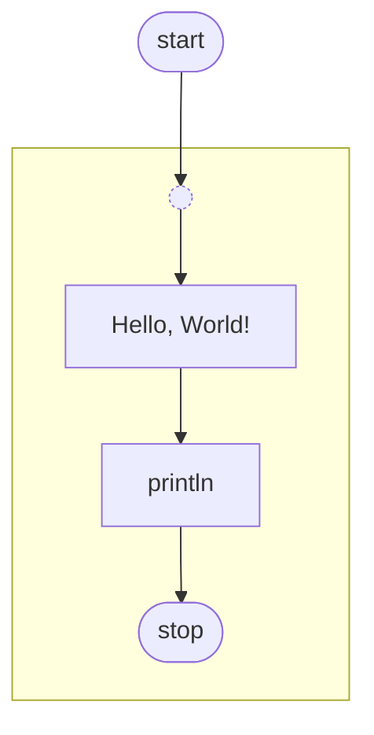

However, deferred connections can be nested within each other! While chained connections don't seem problematic (they unfold as nested in memory but form "flat" chains visually), with deferred connections it's unclear whether nesting is a visualization problem. If we can visualize a single-layer deferred connection, can we visualize nested ones? We need a clear answer to this question.

The impossibility or difficulty of visualizing deferred connection could serve as an argument for its removal as an additional point. We could also consider the option that only single-level deferred connections are allowed. This option, however, is dangerous. It may look logical in theory but in practice lead to a situation where even several deferred connections, not nested within each other, actually form something that is hard to visualize.

Also, regarding deferred connection, it's important to remember that this is a universal mechanism for delaying events, adding "dependencies". In fact, it's just syntactic sugar over `Lock`. Chained connection requires support (which is why we have different versions of some runtime functions, e.g., `New`), while deferred connection is universal. It's more verbose, but universal, and therefore elegant.

### Tagged Union With Data

Tagged union with data (not tag-only, which has no problems) could be visualized if its syntax were more dataflow-like.

> Note: In this document, expressions like "controlflow syntax, dataflow syntax" are used, however, it's important to understand that the language semantics are pure dataflow. Even an expression like `x + y` is actually pure dataflow, where x and y are _streams_ of data, and "+" is a node where they merge.

```
42 -> Type::IntMember -> ...
```

If such a construct were interpreted as "Type::IntMember wraps 42 and sends a message container Type::IntMember(42)", then visualizing this would not be difficult.

However, this conflicts with the chained tag-only union use case, where `42` should simply trigger sending Type::IntMember (a container with only the tag, without data).

Another option that would theoretically work (but won't) is if tagged unions worked like `Struct` (via `#autoport`).

```neva
union_wrapper UnionWrapper<Type::IntMember>
---
42 -> union_wrapper -> ...
```

However, this is impossible because `Type::IntMember` is not a valid type expression. We can reference the union itself, but not its member. A reference to a union member is network syntax.

Another possible solution: `Type::IntMember` *always* means wrapping a value in a container, never triggered tag-only union. And to send tag-only, we first need to create a constant, and then send that.

```
const foo Type = Type::IntMember
```

By the way, creating a constant with a wrapped value in Neva is impossible, because constants exist outside of network computations, and any computations only occur in component networks. That is, `const foo Type = Type::IntMember(42)` is impossible.

So, further in some component's network:

```
$foo -> ...
42 -> Type::IntMember -> ...
```

The disadvantages of this approach are that, firstly, it's less obvious (it doesn't resemble the syntax of, say, Rust, unlike the current implementation), and secondly, it's more verbose — developers need to create constants every time they need just a reference to a union tag. This can be especially tedious when writing pattern-matching using switch/match.

Finally, another option is to change the syntax of the wrapped variant, keeping everything dataflow:

```
... -> Type::IntMember -> ...  // trigger tag-only
42 -> Type::IntMember() -> ... // wrap message 42 in union-container
```

Such a variant can be parsed thanks to `::`, and it somewhat hints at conditional Rust via `()` (though this may cause confusion since we're not passing anything in parentheses). It's fully dataflow and, as a result, appears visualizable.

### General Problem Pattern

While writing this, I realized a general pattern may be emerging. I'm not certain about this, and this statement needs validation. The pattern I see: the natural order of `sender -> receiver` is violated. These are all senders/receivers that "wrap" something, instead of just "receiving and sending". Examples (some fields omitted for simplicity):

```go
type Unary struct {
    Operand  ConnectionSender
    Operator UnaryOperator   
}

type Range struct {
    From int64    // ConnectionSender was planned for the future
    To   int64    // ConnectionSender was planned for the future
}

type Binary struct {
    Left     ConnectionSender
    Right    ConnectionSender
    Operator BinaryOperator  
}

type Ternary struct {
    Condition ConnectionSender
    Left      ConnectionSender
    Right     ConnectionSender
}

type UnionSender struct {
    EntityRef core.EntityRef   
    Tag       string           
    Data      *ConnectionSender
}

// ??? Switch wraps not senders/receivers directly
// (for now, in the future improvements with final sender/receiver are planned, see routers and selectors issues on github)
// but its visualization is not obvious, and in the future other constructs are planned:
// if/match/select/race
type Switch struct {
    Cases   []NormalConnection  
    Default []ConnectionReceiver
}
```

## Workaround: Visualizing "Control-Flow (Like)" Constructs in Dataflow Style

Some constructs that look like control flow in text can be visualized as flow-based (data flow). For example, a binary expression `x + y` can be represented as an operator node with incoming connections from `x` and `y`.

Important: visualization in the editor should not be a literal copy of the desugared program. Some things (ErrGuard, ChainConnection) will be unfolded in IR, but in the visual editor they can be shown in a compact form. This will be a representation similar to desugared, but not identical to it.

### Concerns

Although such an approach could help us "sit on two chairs" (have it both ways), I'm concerned it will complicate the implementation of write operations in the visual editor.

What I mean: suppose we have no network-level abstractions other than regular connections between node ports. In this case, write operations (modifying code/program, e.g., "disconnect `a:b` from `x:y` and connect `x:y` to `foo:bar`") translate 1-to-1 into code. This is a simple way to change the program structure through the visual editor, with no special cases in the logic.

What happens if we go down the path of "control-flow (like) in code and dataflow in visual editor"? This logic stops being straightforward. It becomes important what we disconnected and from where.

## Workaround: Extra-Layer for Visual Editor

Another consideration applicable to all of this: visual representation doesn't necessarily have to equal sourcecode. We could have another "intermediate" representation, exclusively for the visual editor. Perhaps at this level we can encode events such that by catching them, we can unambiguously interpret how sourcecode should change.

This doesn't change the fact that the simpler the language is, and the more dataflow-like its abstractions are (at the component network level, the rest doesn't concern us for now), the easier it would likely be to visualize.

## Solution Strategy

- Compile a list of Neva (sugared) programs that need to be visualized as our "benchmark" for stress-testing the chosen solution. We can compare different variants, allowing the sourcecode structure to change as we want, to see how this affects textual and visual representation. Does the textual representation become unbearably noisy? Does it simplify visualization, and if so, by how much?
- For each variation, create a Mermaid diagram that can be visually evaluated to confirm "yes, this could be visualized this way". Mermaid is just a convenient tool for "debugging" the design. It's uncertain whether we'll use it for implementing the visual editor itself, though we could. We might also want to add a Mermaid backend for IR/desugared or even sourcecode, but this is beyond the current discussion.

---

> These are easy to visualize features

# FanIn/FanOut

## Sugared

```neva
[s1, s2] -> [r1, r2]
```

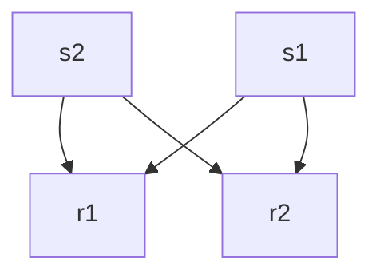

## Desugared

```neva
fan_in FanIn<T>
fan_out FanIn<T>
---
s1 -> fan_in[0]
s2 -> fan_in[1]
fan_in -> fan_out
fan_out[0] -> r1
fan_out[1] -> r2
```

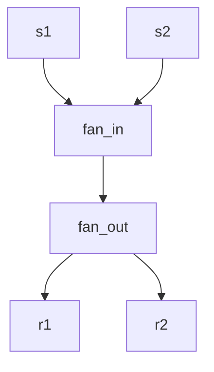

# ErrGuard

## Sugared

```neva
println fmt.Println?
---
:data -> println -> :res
```

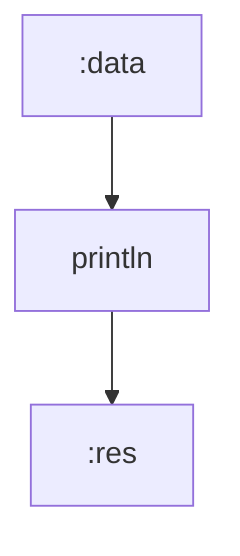

## Desugared

```neva
println fmt.Println
---
:data -> println
println:res -> :res
println:err -> :err
```

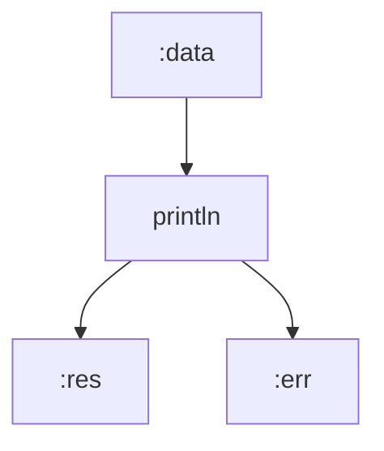

# Chained Connection

## Sugared

```neva
foo -> bar -> baz
```

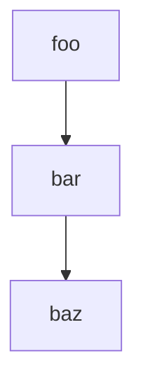

## Desugared

```neva
foo:a -> bar:b
bar:c -> baz:d
```

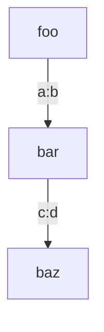

# Const

## Sugared

```neva
:foo -> $pi -> do_x
:bar -> 42 -> do_y
```

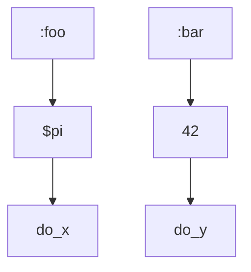

## Desugared

```neva
const fourty_two int = 42

// ...

#bind($pi)
new_pi New<float>

#bind($fourty_two)
new_fourty_two New<int>

---

:foo -> new_pi -> do_x
:bar -> new_fourty_two -> do_y
```

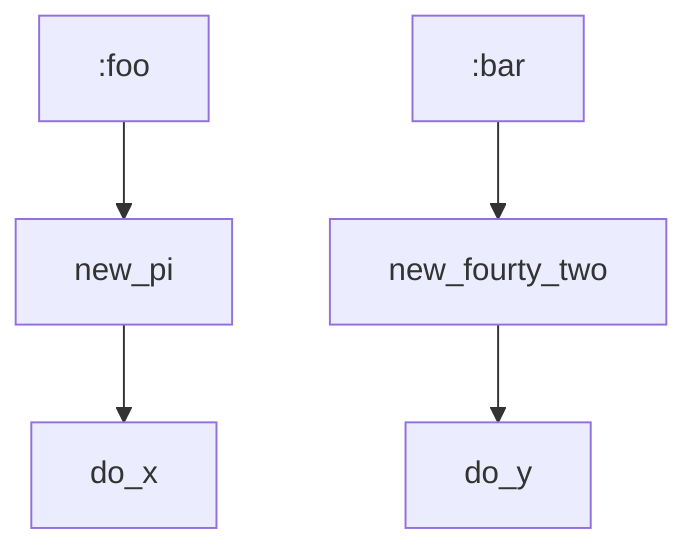

## Verdict

Not really related to this document, just figured out. We must remove support for non-chained constant/literal senders, keep only one version of the runtime function and stdlib component that exposes it, and update all the examples and e2e tests involved.

# Struct Selector

## Sugared

```neva
foo -> bar.baz -> bax
```

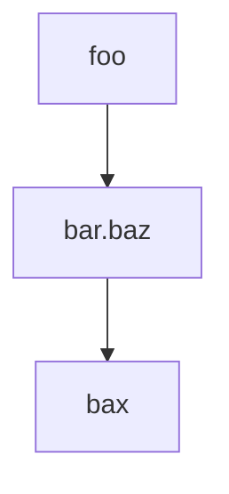

## Desugared

```neva
const path list<string> = ['bar', 'baz']

// ...

#bind(path)
field Field<T>
---
foo -> field -> bax
```

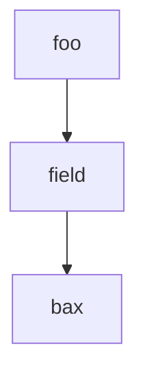

> These are questionable to visualize features

# Unary

## Sugared

```neva
-foo -> bar
```

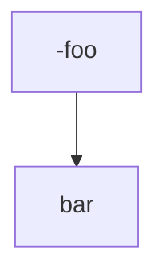

## Desugared

```neva
neg Neg
---
foo -> neg -> bar
```

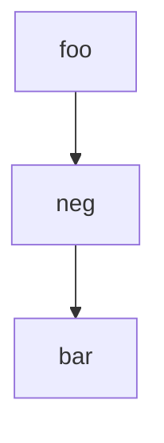

# Deferred Connection

## Sugared

```neva
foo -> { bar -> baz }
```

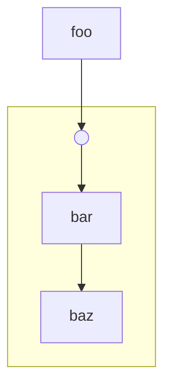

## Desugared

```neva
lock Lock<T>
---
foo -> lock:sig
bar -> lock:data
lock:res -> baz
```

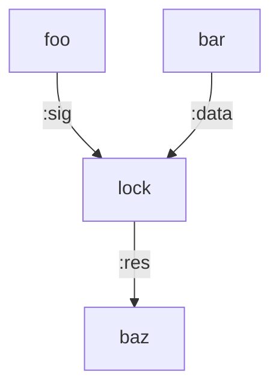

# Range

## Sugared

```neva
foo..bar -> println
```

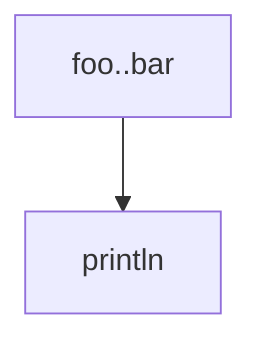

## Desugared

```neva
range Range
---
foo -> range:from
bar -> range:to
range:res -> println
```

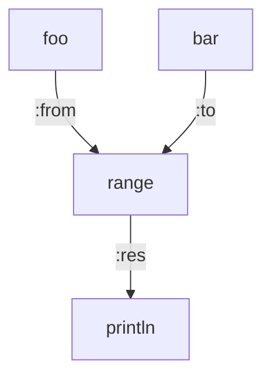

# Binary

## Sugared

```neva
(foo + bar) -> println
```

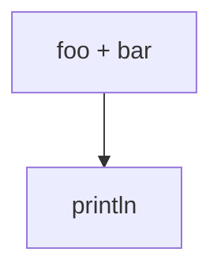

## Desugared

```neva
add Add
---
foo -> add:left
bar -> add:right
add:res -> println
```

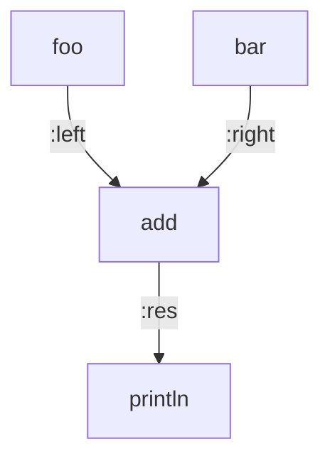

# Ternary

## Sugared

```neva
(foo ? bar : baz) -> println
```

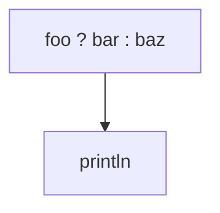

## Desugared

```neva
ternary Ternary
---
foo -> ternary:condition
bar -> ternary:left
baz -> ternary:right
ternary:res -> println
```

```mermaid
flowchart TB
    foo -->|:if|ternary
    bar -->|:then|ternary
    baz -->|:else|ternary
    ternary --> |:res|println
```

# Union

## Sugared

```neva
Type::Member -> println
Type::Member(foo) -> println
```

```mermaid
flowchart TB
    node_a["Type::Member"] --> foo
    node_b["Type::Member(bar)"] --> baz
```

## Desugared

```neva
const __const__1 Type = Type::Member

// ...

#bind(__const__1)
union_sender_1 UnionSenderV1<Type>

union_sender_2 UnionSenderV2<Type>

---

union_sender -> println1

foo -> union_sender -> println2
```

```mermaid
flowchart TB
    union_sender_1 --> println1
    foo --> union_sender_2 --> println2
```

# Switch

## Sugared

```neva
a -> switch {
    b -> c
    d -> e
}
```

```mermaid
flowchart TB
    subgraph switch
      b --> c
      d --> e
    end

    a --> switch
```

## Desugared

```neva
switch Switch
---
a -> switch:data
b -> switch:if[0]
d -> switch:if[1]
switch:then[0] -> c
switch:then[1] -> e
switch:else -> println
```

```mermaid
flowchart TB
    a -->|:data|switch
    b -->|:if0|switch
    d -->|:if1|switch
    switch -->|:then0|c
    switch -->|:then1|e
    switch -->|:else|println
```

----

> Proposed Changes

# Unary

## Keep feature, but rewrite into dataflow

Current textual and visual sugared representations both hide the fact that `foo` sends to some node, and that we block until that happens.

There's an alternative design in dataflow spirit. It is perhaps more cryptic textually but as explicit in dataflow as desugared representation visually

```neva
foo -> - -> bar
```

```mermaid
flowchart TB
    foo --> - --> bar
```

The idea is to only allow unary operator nodes as heads of the chained connections. Example pseudocode:

```pseudocode
from: portAddr{foo}
to: chainedConn{
    from: Unary{Neg}
    to: portAddr{bar}
}
```

This way compiler can connect input and output of the unary operator node. It is otherwise would be impossible, because unary operator node doesn't have network address, like normal node.

> Note that current design solves this with non-dataflow pattern - unary node wraps/refers other sender, so compiler knows about both its input and output.

The operator node itself becomes just this:

```go
type UnaryOperatorSender struct {
    Operator string
}
```

We would need to change all compiler levels from parsing up until the desugarer. Everything that goes after desugared program remains untouched.

- Parser: replace old `<op><sender>` syntax with `<op> -> receiver`, update tests, etc.
- Analyzer: make sure unary operator network senders are only supported as chained connection heads, and adapt old existing code to new design
- Desugarer: adapt old existing code to new design. The result of desugaring is the same as before

## Remove feature, use plain nodes

```neva
import { operators }

add operators.Add
---
foo -> add:left
bar -> add:right
add -> ...
```

# Deferred Connection

## Remove feature, use plain nodes

```neva
import { sync }

lock sync.Lock
---
foo -> lock:sig
bar -> lock:data
lock -> baz
```

## Keep feature, visualize as dataflow

```mermaid
flowchart TB
    foo --> lock
    bar --> lock
    lock --> baz
```

# Binary

...