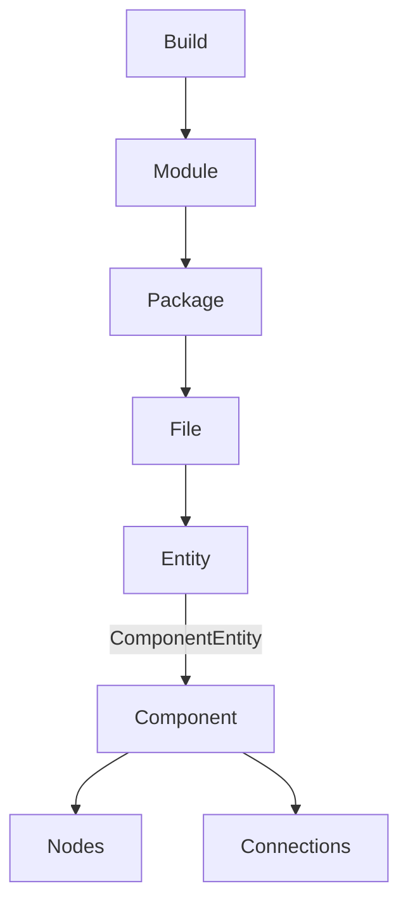
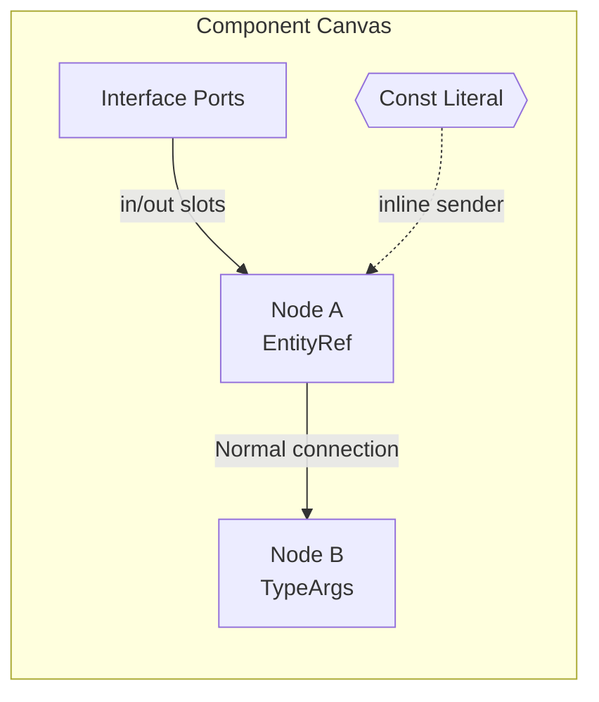

# Visual Editor AI Notes

# Visual Editor Mapping

## Purpose
This document merges three alternative analyses into a single consolidated view of how Neva’s textual abstractions map to a visual (node-based) editor. Where approaches clearly align, they are unified. Where multiple reasonable options exist, they are preserved as labeled alternatives for future design decisions.

## Context
Nevalang/Neva is expressed as data-flow graphs: immutable messages propagate across nodes in parallel, making a visual experience a natural complement to the textual syntax.【F:CONTEXT.md†L7-L14】 The source-code layer already models programs as structured graphs of components, nodes, ports, and connections,【F:internal/compiler/sourcecode/sourcecode.go†L91-L318】 so a visual editor can lean directly on these abstractions.

## Structural Hierarchy
Neva code forms a hierarchy of build → modules → packages → files → entities, culminating in components whose internals are graph-based. A visual editor can mirror this nesting as project navigation panes feeding into the node canvas.【F:internal/compiler/sourcecode/sourcecode.go†L12-L88】

- Build / Module / Package / File: project navigation (tree and dependency/browser views).  
- Entity (const/type/interface/component): sidebar cards or palette primitives; component entities open a graph canvas; non-component entities open inspectors.【F:internal/compiler/sourcecode/sourcecode.go†L91-L123】

## Mapping Textual Abstractions to Visual Concepts
| Source abstraction | Key fields | Visual mapping | Notes |
| --- | --- | --- | --- |
| Module / Package | `Module{Manifest, Packages}`, `Package{Files, Entities}`【F:internal/compiler/sourcecode/sourcecode.go†L19-L78】 | Project browser tree (module → package → file → entity) | Manifest editing via side panel. |
| Entity (Const / Type / Interface / Component) | `Entity{Kind, Const, Type, Interface, Component}`【F:internal/compiler/sourcecode/sourcecode.go†L91-L122】 | Palette entries and inspector panels | Non-components appear as palette items or inspectors. |
| Component | `Interface`, `Directives`, `Nodes`, `Net`【F:internal/compiler/sourcecode/sourcecode.go†L124-L131】 | Canvas document | Workspace with node graph + interface sidebar. |
| Interface | `TypeParams`, `IO` ports【F:internal/compiler/sourcecode/sourcecode.go†L136-L175】【F:internal/compiler/sourcecode/sourcecode.go†L265-L275】 | Interface header listing generics and port badges | Array ports flagged with bracket markers. |
| Node instance | `Node{EntityRef, TypeArgs, ErrGuard, DIArgs, OverloadIndex}`【F:internal/compiler/sourcecode/sourcecode.go†L171-L196】 | Graph node with icon/title from `EntityRef` | Show type-arg chips; `?` badge for `ErrGuard`; DI slots; overload selector in inspector. |
| Connections | `Connection{Normal, ArrayBypass}` with nested senders/receivers【F:internal/compiler/sourcecode/sourcecode.go†L277-L305】 | Edges between ports with adornments | Support multi-sender/receiver hyperedges; array bypass as bundled jumper. |
| Expression senders | `ConnectionSender{Const, Range, Unary, Binary, Ternary, StructSelector, Union}`【F:internal/compiler/sourcecode/sourcecode.go†L308-L354】 | Inline expression nodes or edge badges | Open editor bubbles for complex expressions. |
| Const values | `Const{TypeExpr, Value}` and `MsgLiteral`【F:internal/compiler/sourcecode/sourcecode.go†L198-L263】 | Literal nodes or inspector editors | Provide draggable constants with structured editors.

### Example flow

## Detailed Visual Treatments

### Component Interface & Type Parameters
- Interface boundary: frame with port handles derived from `IO.In` / `IO.Out`. Array ports appear as expandable stacks (e.g., `foo[0]`, `foo[1]`) because `Port.IsArray` marks multi-slot ports.【F:internal/compiler/sourcecode/sourcecode.go†L265-L275】
- Generic parameters: display `TypeParams` near the title bar; when instantiating, expose dropdowns/fields to bind each parameter.【F:internal/compiler/sourcecode/sourcecode.go†L136-L169】

### Node Representation
- Base node card: title shows `Node.EntityRef`; badges indicate `ErrGuard` (`?`) and `Directives`.【F:internal/compiler/sourcecode/sourcecode.go†L171-L179】
- Type arguments: `<T, U>` chips derived from `Node.TypeArgs`.【F:internal/compiler/sourcecode/sourcecode.go†L185-L196】
- Dependency injection (`DIArgs`): embedded slots or collapsible subpanels hosting nested node graphs; show relationships distinctly from data-flow to avoid confusion.【F:internal/compiler/sourcecode/sourcecode.go†L171-L178】
- Overload selection: inspector dropdown tied to `Node.OverloadIndex` listing available variants.【F:internal/compiler/sourcecode/sourcecode.go†L171-L178】

### Connections and Flow Logic
- Normal connections: polyline edges from senders to receivers; support multi-sender/receiver hyperedges; annotate struct selectors with field paths (e.g., `.foo.bar`).【F:internal/compiler/sourcecode/sourcecode.go†L283-L318】
- Array bypass: bundled jumper directly connecting array slots; show `[*]` or compact glyph to indicate element-wise forwarding.【F:internal/compiler/sourcecode/sourcecode.go†L289-L292】
- Switch branching: decision widget routing into `Cases` plus optional `Default`; each case is a `NormalConnection` rendered as per-branch bundles.【F:internal/compiler/sourcecode/sourcecode.go†L294-L305】
- Expression senders: badges on edges for `Const`, `Range`, `Unary`, `Binary`, `Ternary`; open inline editors or bubbles for complex expressions.【F:internal/compiler/sourcecode/sourcecode.go†L308-L354】
- Union senders: labeled capsules (`Type::Tag`) with optional nested editor for `Data`.【F:internal/compiler/sourcecode/sourcecode.go†L320-L329】

### Constants & Literals
- Draggable literal nodes for booleans, numbers, strings, lists, dicts, unions; nested values appear as structured inspector editors (tree/table/stack).【F:internal/compiler/sourcecode/sourcecode.go†L198-L263】
- Referencing another const (`ConstValue.Ref`) should render as a link badge pointing to the source entity.

## Challenging / Ambiguous Areas
1. Recursive receivers and nested connections: `ConnectionReceiver` can embed `DeferredConnection` and `ChainedConnection`, and `Switch` creates recursive fragments; inline visualization risks clutter. Use expandable subgraphs or stacked cards inside inspectors.【F:internal/compiler/sourcecode/sourcecode.go†L294-L305】
2. Switch routing: each branch is a full `NormalConnection`; naïve inline rendering duplicates layout. Prefer compact node with drill-down or per-branch bundles as needed.【F:internal/compiler/sourcecode/sourcecode.go†L302-L305】
3. Dependency-injected subgraphs: `DIArgs` nest entire `Node` definitions; show as slots/overlays distinct from message edges to avoid mixing configuration with data-flow.【F:internal/compiler/sourcecode/sourcecode.go†L171-L178】
4. Union sender data depth: `UnionSender.Data` is a full `ConnectionSender`; support deep editors (form-based or mini-canvas) to manage complexity.【F:internal/compiler/sourcecode/sourcecode.go†L320-L329】
5. Array ports: `IsArray` demands contiguous indices and index management; provide add/remove UI enforcing contiguity and signaling gaps.【F:internal/compiler/sourcecode/sourcecode.go†L265-L275】

## Canonical Patterns (Unified)
- Hyperedge connection hubs for `NormalConnection` to group multiple senders/receivers with a hoverable inspector enumerating members.
- Semantic coloring and badges to distinguish data-flow, configuration (DI), and control-flow (switch).
- Property panel on the right for advanced features (overload selection, directives, type arguments) to reduce canvas noise.

## Alternatives (retain for future selection)

### Connection Expressions
- Alternative A (inline edge blocks – compact): insert mini expression nodes/badges along the edge; click to expand an infix editor. Best for simple/moderate expressions.
- Alternative B (edge inspector panels – form-based): clicking an edge opens a tree/AST inspector suitable for complex ternary or union payloads.
- Alternative C (dedicated expression micro-nodes – explicit): convert expressions into micro-nodes on the canvas, auto-grouped with their host hyperedge for clarity.

### Switch Handling
- Alternative A (tabbed switch node – compact): a single node with tabs per case plus a default lane; each tab hosts a mini-canvas.
- Alternative B (expandable case lanes – comparative): collapsible horizontal swimlanes under the switch node to compare branches side-by-side.
- Alternative C (branch inspector panels – focused): keep a single wire on the canvas; open a side panel detailing the selected branch as a mini-graph.

### Dependency Injection
- Alternative A (node-embedded slots – direct): DI arguments appear as socket groups on the parent node for drag-and-drop injection.
- Alternative B (visual overlay – decoupled): DI nodes appear above their host with dashed connectors and labeled slots, distinct from data-flow edges.
- Alternative C (configuration tab – textual): a right-hand configuration tab listing DI arguments referencing other nodes by name; better for shallow DI graphs.

### Array Bypass Visualization
- Alternative A (bundled wire with `[*]` glyph): thick jumper annotated with element-wise forwarding.
- Alternative B (minimal jumper styling): compact jumper edges emphasizing mechanical role, with tooltip for details.

## Recommendations
1. Prefer graph canvas + inspector model: keep the main canvas focused on nodes and primary connections; handle recursion and deep structures in inspectors.
2. Adopt a consistent hyperedge pattern for `NormalConnection` to normalize multi-sender/receiver flows.
3. Use semantic coloring/badges to differentiate data-flow vs configuration vs control-flow.
4. Place overload selection, directives, and type-argument binding in the property panel to reduce noise.

## Summary of Readiness
- Core abstractions (nodes, ports, edges, palettes) map directly to standard visual editor constructs, enabling a straightforward implementation path.
- Complexity concentrates in recursive connection structures, switch branching, DI nesting, union payload depth, and array mechanics; the alternatives above provide viable patterns to address these without sacrificing clarity.

---

*Notepad ID: d891a9af-eaa6-43b3-868e-4fd1133c5d15*

*Created: 10/29/2025, 12:25:52 AM*

