> These are easy to visualize features

# FanIn/FanOut

## Sugared

```neva
[s1, s2] -> [r1, r2]
```

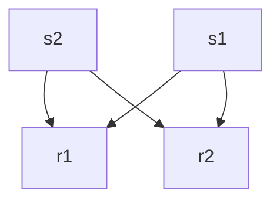

## Desugared

```neva
fan_in FanIn<T>
fan_out FanIn<T>
---
s1 -> fan_in[0]
s2 -> fan_in[1]
fan_in -> fan_out
fan_out[0] -> r1
fan_out[1] -> r2
```

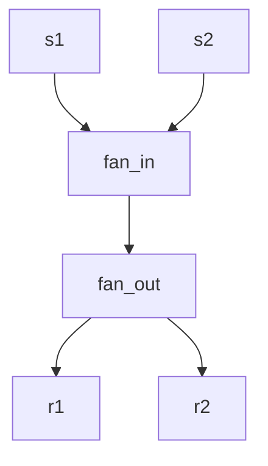

# ErrGuard

## Sugared

```neva
println fmt.Println?
---
:data -> println -> :res
```

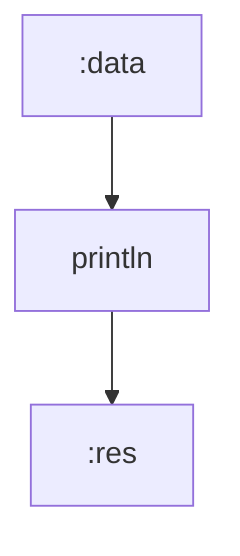

## Desugared

```neva
println fmt.Println
---
:data -> println
println:res -> :res
println:err -> :err
```

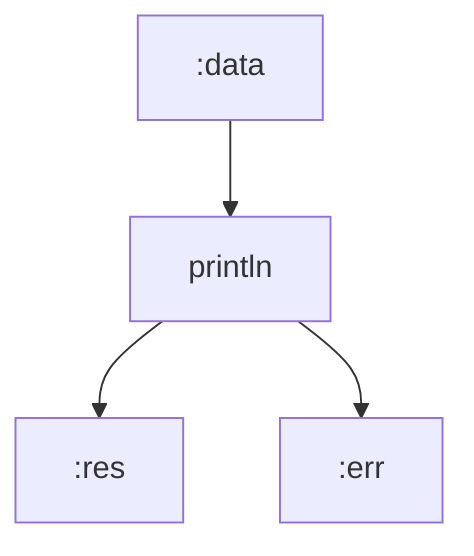

# Chained Connection

## Sugared

```neva
foo -> bar -> baz
```

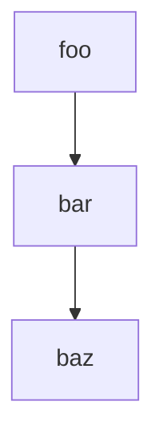

## Desugared

```neva
foo:a -> bar:b
bar:c -> baz:d
```

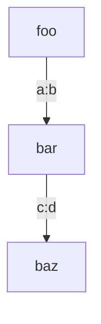

# Const

## Sugared

```neva
:foo -> $pi -> do_x
:bar -> 42 -> do_y
```

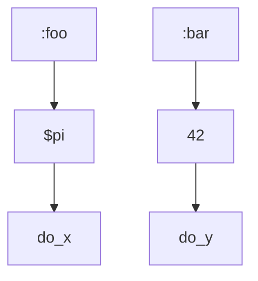

## Desugared

```neva
const fourty_two int = 42

// ...

#bind($pi)
new_pi New<float>

#bind($fourty_two)
new_fourty_two New<int>

---

:foo -> new_pi -> do_x
:bar -> new_fourty_two -> do_y
```

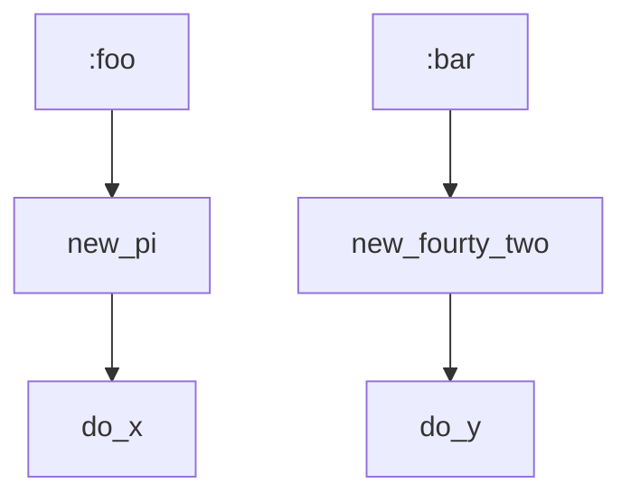

## Verdict

Not really related to this document, just figured out. We must remove support for non-chained constant/literal senders, keep only one version of the runtime function and stdlib component that exposes it, and update all the examples and e2e tests involved.

# Struct Selector

## Sugared

```neva
foo -> bar.baz -> bax
```

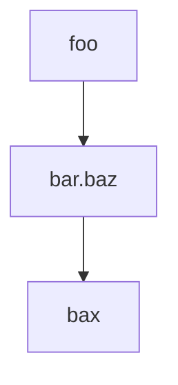

## Desugared

```neva
const path list<string> = ['bar', 'baz']

// ...

#bind(path)
field Field<T>
---
foo -> field -> bax
```

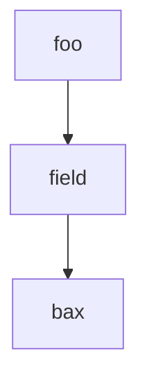

> These are questionable to visualize features

# Unary

## Sugared

```neva
-foo -> bar
```

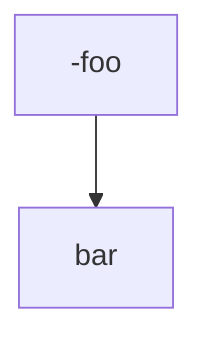

## Desugared

```neva
neg Neg
---
foo -> neg -> bar
```

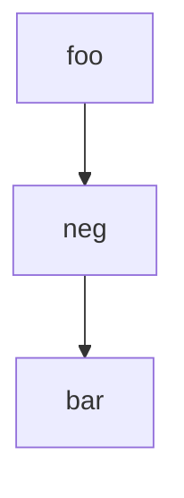

# Deferred Connection

## Sugared

```neva
foo -> { bar -> baz }
```

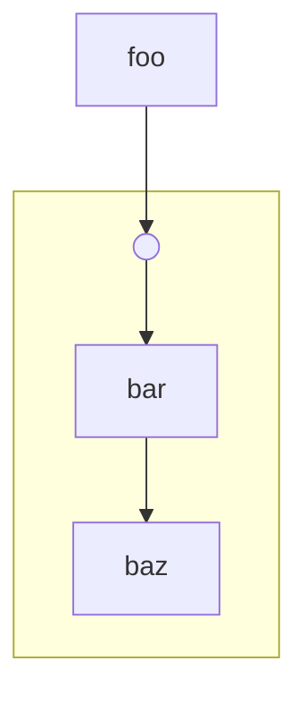

## Desugared

```neva
lock Lock<T>
---
foo -> lock:sig
bar -> lock:data
lock:res -> baz
```

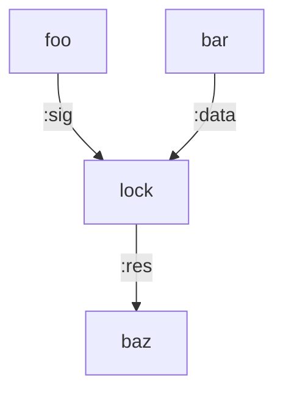

# Range

## Sugared

```neva
foo..bar -> println
```

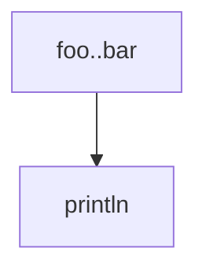

## Desugared

```neva
range Range
---
foo -> range:from
bar -> range:to
range:res -> println
```

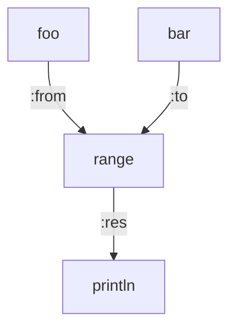

# Binary

## Sugared

```neva
(foo + bar) -> println
```

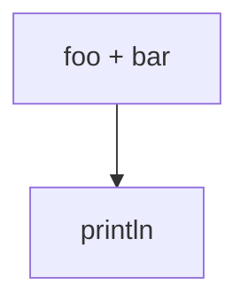

## Desugared

```neva
add Add
---
foo -> add:left
bar -> add:right
add:res -> println
```

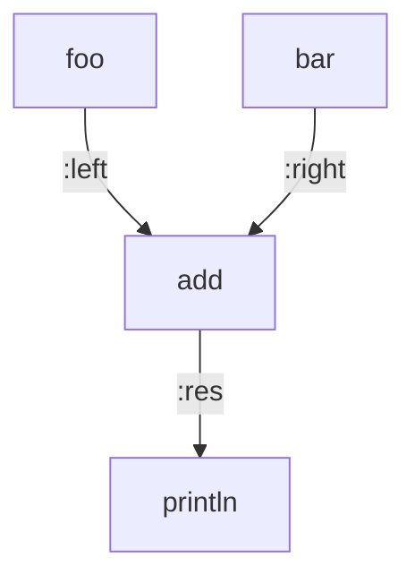

# Ternary

## Sugared

```neva
(foo ? bar : baz) -> println
```

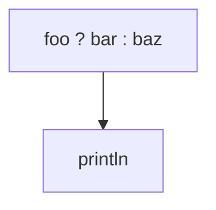

## Desugared

```neva
ternary Ternary
---
foo -> ternary:condition
bar -> ternary:left
baz -> ternary:right
ternary:res -> println
```

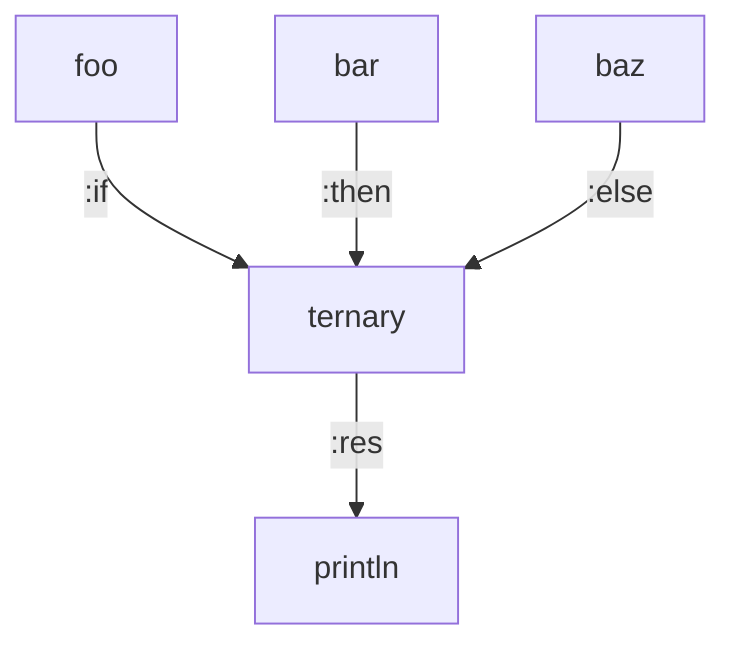

# Union

## Sugared

```neva
Type::Member -> println
Type::Member(foo) -> println
```

```mermaid
flowchart TB
    node_a["Type::Member"] --> foo
    node_b["Type::Member(bar)"] --> baz
```

## Desugared

```neva
const __const__1 Type = Type::Member

// ...

#bind(__const__1)
union_sender_1 UnionSenderV1<Type>

union_sender_2 UnionSenderV2<Type>

---

union_sender -> println1

foo -> union_sender -> println2
```

```mermaid
flowchart TB
    union_sender_1 --> println1
    foo --> union_sender_2 --> println2
```

# Switch

## Sugared

```neva
a -> switch {
    b -> c
    d -> e
}
```

```mermaid
flowchart TB
    subgraph switch
      b --> c
      d --> e
    end

    a --> switch
```

## Desugared

```neva
switch Switch
---
a -> switch:data
b -> switch:if[0]
d -> switch:if[1]
switch:then[0] -> c
switch:then[1] -> e
switch:else -> println
```

```mermaid
flowchart TB
    a -->|:data|switch
    b -->|:if0|switch
    d -->|:if1|switch
    switch -->|:then0|c
    switch -->|:then1|e
    switch -->|:else|println
```