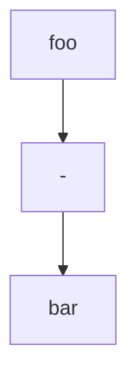
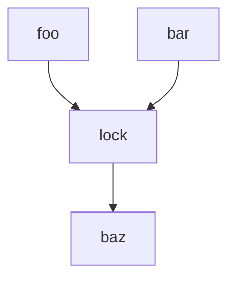

> Proposed Changes

# Unary

## Keep feature, but rewrite into dataflow

Current textual and visual sugared representations both hide the fact that `foo` sends to some node, and that we block until that happens.

There's an alternative design in dataflow spirit. It is perhaps more cryptic textually but as explicit in dataflow as desugared representation visually

```neva
foo -> - -> bar
```



The idea is to only allow unary operator nodes as heads of the chained connections. Example pseudocode:

```pseudocode
from: portAddr{foo}
to: chainedConn{
    from: Unary{Neg}
    to: portAddr{bar}
}
```

This way compiler can connect input and output of the unary operator node. It is otherwise would be impossible, because unary operator node doesn't have network address, like normal node.

> Note that current design solves this with non-dataflow pattern - unary node wraps/refers other sender, so compiler knows about both its input and output.

The operator node itself becomes just this:

```go
type UnaryOperatorSender struct {
    Operator string
}
```

We would need to change all compiler levels from parsing up until the desugarer. Everything that goes after desugared program remains untouched.

- Parser: replace old `<op><sender>` syntax with `<op> -> receiver`, update tests, etc.
- Analyzer: make sure unary operator network senders are only supported as chained connection heads, and adapt old existing code to new design
- Desugarer: adapt old existing code to new design. The result of desugaring is the same as before

## Remove feature, use plain nodes

```neva
import { operators }

add operators.Add
---
foo -> add:left
bar -> add:right
add -> ...
```

# Deferred Connection

## Remove feature, use plain nodes

```neva
import { sync }

lock sync.Lock
---
foo -> lock:sig
bar -> lock:data
lock -> baz
```

## Keep feature, visualize as dataflow



# Binary

