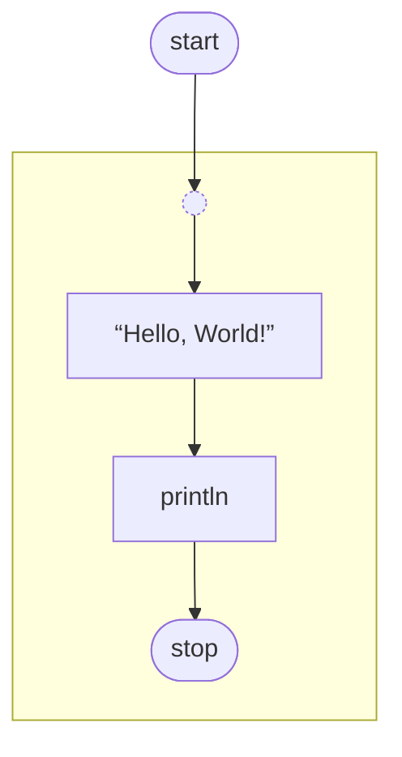

# Упрощение языка

## Проблема

Язык постоянно усложняется добавлением новых фич, что откладывает разработку визуального редактора. Возникает вопрос: не находимся ли мы в ловушке? Возможно, ключ к успеху — упростить язык, убрав лишние абстракции и их комбинации. Тогда:
- визуализация станет проще
- текстовое представление станет более многословным, но это компенсируется визуальным редактором

## Разница между IR и desugared program

**IR (промежуточное представление)** — низкоуровневое представление между исходным кодом и рантаймом. Разработчик напрямую писать на IR не может (и не должен). У нас есть dot-бэкенд для визуализации IR.

**Desugared program** — программа без синтаксического сахара, которую разработчик теоретически может писать руками (но не хочет из-за низкой читаемости). Примеры: ErrGuard и ChainConnection можно выразить вручную, но это добавляет шум.

## Визуализация фич

### Легко визуализируются

- *FanIn/FanOut* (`[...] -> ...` и `... -> [...]`, дешурагится в `fan_in/fan_out` узлы и соединения, визуализируется без каких-либо проблем)
- *ErrGuard* (`some_node SomeNode?` - не влияет на сложность визуализации сети, потому что просто убирает лишнее соединение `some_node:err -> :err`)
- *ChainConnection* (`foo -> bar -> baz` вместо `foo:a -> bar:b -> baz:c`, неявная подстановка порта не вредит визуализации)
- *Const* (`foo -> $bar -> ...`)
- *Struct Selector* (покуда поддерживаются только внутри chained connections e.g. `foo -> .bar -> baz` а не `foo.bar -> baz`)

### Вызывают сомнения:

- *Range* (range синтаксис также является проблемой для выноса сущностей `type stream` и `def Range` в пакет `streams`, так как компилятор становится вынужден знать об этом пакете, что плохо, смотри PR https://github.com/nevalang/neva/pull/926 и issue которое он пытается закрыть https://github.com/nevalang/neva/issues/924)
- *Unary/Binary/Ternary Expressions* (выражаются обычными узлами+соединениями, но в тексте создает много шума)
- *Union Sender*
    - Tag-only - `Type::Member -> ...` сам по себе, кажется, проблем не вызывает (особенно в виде chained `... -> Type::Member -> ...`, на момент написания документа еще не реализовано)
    - Tag and Data - `Type::Member(wrapped_sender) -> ...`, тут начинаются проблемы, потому что мы ссылаемся на другого отправителя (network sender), "нестандартным" (для dataflow) образом, то есть без _явного_ соединения его с получателем (tagged union wrapper)
- *Deferred Connection* - вообще в целом неоднозначная фича (в https://github.com/nevalang/neva/issues/717#issue-2565619530 даже рассматривалась возможность ее удаления без, однако, достаточной аргументации)
- *Switch* - как в его текущей реализации, так и proposal "Routers and Selectors"
  - `if` https://github.com/nevalang/neva/issues/802 (не реализован, частично эмулируется текущим `switch`)
  - `switch` https://github.com/nevalang/neva/issues/804 (частично реализован)
  - `match` https://github.com/nevalang/neva/issues/805 (частично реализован как component, runtime function, без поддержки на уровне language feature)
  - `select` https://github.com/nevalang/neva/issues/806 ((частично?) реализован как component, runtime function, без поддержки на уровне language feature)
  - `race` https://github.com/nevalang/neva/issues/807 (не реализован)


**Deferred Connection**

Однажды мне пришло в голову, что визуализировать deferred connection можно было бы следующим образом (схема не точная):

```neva
:start -> { 'Hello, World!' -> println -> :stop }
```

->



Надо помнить, однако, что deferred connections могут быть вложены друг в друга! И если в случае с chained connections в этом, кажется, нет проблемы (то как они развернуты в памяти, это вложенность, но визуально они образуют "плоские" цепочки), то с deferred уже не очевидно, не проблема ли это для визуализации. Предположим, что мы можем визуализировать однослойное deferred connection, но можем ли мы визуализировать вложенное? Нужен четкий ответ на этот вопрос.

Невозможность или сложность визуализации deferred connection может служить доводом в пользу его упразднения, как дополнительный аргумент. Также можно рассмотреть вариант, что разрешены лишь одновложенные deferred connections. Этот вариант, однако, опасен. Он может выглядеть логично в теории, а по факту привести к ситуации, что даже несколько deferred connections, не вложенные друг в друга, на самом деле образуют нечто, что тяжело визуализировать.

Также про deferred connection важно помнить, что это универсальный механизм задержки события, добавления "зависимости". По факту просто синтаксический сахар над `Lock`. Chained connection требует поддержки (от этого у нас есть разные версии некоторых runtime functions, например `New`), в то время как deferred connection универсален. Он более шумен, но универсален, и этим элегантен.

**Tagged Union With Data**

Визуализировать tagged union with data (не tag-only, с которым проблемы нет), можно было бы, если бы его синтаксис был бы более dataflow

> Примечание: в этом документе используются выражения вроде "синтаксис controlflow, синтаксис dataflow", однако, важно понимать, что семантика языка это чистое dataflow. Даже выражение вида `x + y` это на самом деле pure dataflow, где x и y это _потоки_ данных, а "+" это узел, в котором они сливаются.

```
42 -> Type::IntMember -> ...
```

Если бы такая конструкция интерпретировалась как "Type::IntMember оборачивает 42 и посылает сообщение-контейнер Type::IntMember(42)", то визуализировать это было бы не сложно.

Это, однако, к сожалению конфликтует с chain tag only union юзкейсом, которая условное `42` должно просто триггернуть (толкнуть, kick) отправку Type::IntMember (контейнера с уже только тегом, без данных).

Еще один вариант, который в теории сработал бы (но не сработает), это если бы tagged unions работали как `Struct` (через `#autoport`).

```neva
union_wrapper UnionWrapper<Type::IntMember>
---
42 -> union_wrapper -> ...
```

Такое однако невозможно потому что `Type::IntMember` не валидное type expression. Мы можем сослаться на сам юнион, но не на его член. Ссылка на член (member) юниона это синтаксис сети (network).

Еще одно возможное решение: `Type::IntMember` *всегда* означает оборачивание значения в контейнер, никогда не triggered tag-only union. А для отправки tag-only нам надо сперва создать константу, и затем отправить уже ее.

```
const foo Type = Type::IntMember
```

Кстати, создать константу с обернутым значением в Neva невозможно, потому что константы существуют за пределами вычислений сети, а любые вычисления происходят только в сетях компонентов. То есть `const foo Type = Type::IntMember(42)` невозможно.

Так вот, далее в сети некоторого компонента:

```
$foo -> ...
42 -> Type::IntMember -> ...
```

Недостатки такого подхода в том, что он, во-первых, менее очевиден (это непохоже на синтаксис, скажем, Rust, в отличии от текущей реализации), а во-вторых более многословен - разработчику надо создавать константы каждый раз, когда ему нужна просто ссылка на тег юниона. Это может быть особенно надоедливым упражнением, когда мы пишем какой-то pattern-matching с использованием switch/match.

И наконец еще один вариант который мне виден, это изменить синтаксис wrapped варианта, оставив все dataflow:

```
... -> Type::IntMember -> ...  // триггер tag-only
42 -> Type::IntMember() -> ... // оборачивание сообщения 42 в union-контейнер
```

Кажется, что такой вариант можно распарсить благодаря `::`, при этом он хотя бы немного намекает на условный Rust посредством `()` (хотя кто-то может сказать, что это больше вызывает путанницу, ведь мы ничего не передаем в скобки), полностью dataflow и, как следствие, (вроде бы?) визуализируется.

### Общий Паттерн Проблемы

Пока я писал все это, на меня нашла мысль, что прослеживается некий общий паттерн. Я не уверен в этом, и данное высказывание нуждается в валидации. Так или иначе, паттерн что я вижу, выглядит так: нарушается естественный порядок `sender -> receiver`. Это все sender/receiver которые "оборачивают" что-то, вместо того чтобы просто "получать и посылать". Примеры (некоторые поля могут быть опущены для простоты):

```go
type Unary struct {
    Operand  ConnectionSender
    Operator UnaryOperator   
}

type Range struct {
    From int64    // в будущем планировался ConnectionSender
    To   int64    // в будущем планировался ConnectionSender
}

type Binary struct {
    Left     ConnectionSender
    Right    ConnectionSender
    Operator BinaryOperator  
}

type Ternary struct {
    Condition ConnectionSender
    Left      ConnectionSender
    Right     ConnectionSender
}

type UnionSender struct {
    EntityRef core.EntityRef   
    Tag       string           
    Data      *ConnectionSender
}

// ??? Switch оборачивает не senders/receivers напрямую
// (пока что, в будущем планируются доработки с final sender/receiver, смотри routers and selectors issues на github)
// но его визуализация не очевидна, а в будущем планируются и другие конструкции:
// if/match/select/race
type Switch struct {
    Cases   []NormalConnection  
    Default []ConnectionReceiver
}
```

## Workaround. Визуализация "control-flow (like)" конструкция в стиле Dataflow

Некоторые конструкции, которые выглядят как control flow в тексте, можно визуализировать как flow-based (поток данных). Например, бинарное выражение `x + y` можно представить как узел-оператор с входящими соединениями от `x` и `y`.

Важно: визуализация в редакторе не должна быть буквальной копией desugared программы. Некоторые вещи (ErrGuard, ChainConnection) будут разворачиваться в IR, но в визуальном редакторе их можно показывать в компактном виде. Это будет представление, похожее на desugared, но не идентичное ему.

### Опасения

И хоть я и вижу, как такой подход мог бы помочь "усидеть на двух стульях", у меня, однако, есть опасение, что он затруднит реализацию пишущих операций в визуальном редакторе.

Что я имею в виду - предположим, у нас нет абстракций уровня сети, кроме обычных соединений между портами узлов. В таком случае (по крайней мере, мне так кажется. Поправь меня, если я не прав) пишущие (модифицирующие, изменяющие код/программу) операции (например "отсоеденить `a:b` от `x:y` и присоеденить `x:y` к `foo:bar`), транслируются 1 к 1 в код. Это простой способ изменить структуру программы через визуальный редактор, в логике нет исключительных случаев.

Что же мы имеем, если идем по пути "control-flow (like) в коде и dataflow в визуальном редакторе"? Кажется, что эта логика перестает быть straightforward. Нам становится важно, что и откуда мы отсоеденили.

## Workaround. Extra-Layer for Visual Editor

Еще одна мысль, пусть она будет над всем сказанным до, применимая ко всему этому, что визуальное представление не обязательно должно быть = sourcecode. У нас может быть еще одно "промежуточное" представление, исключительно для визуального редактора. Быть может, на этом уровне мы сможем закодить события таким образом, что отлавливая их, мы сможем однозначно трактовать, как должен измениться sourcecode.

Так или иначе, это вряд ли отменит тот факт, что чем проще был бы язык, и чем более dataflow-like в нем были бы абстракции (уровня сети компонента, остальное нас пока не волнует), тем, скорее всего, проще он поддавался бы визуализации.

## Стратегия Решения

- Составить список neva (sugared) программ, которые надо визуализировать, пусть они будут нашим "бенчмарком" для проверки на прочность выбранного решения. Мы можем сравнивать разные варианты, допуская, что структура sourcecode меняется так, как мы хотим, чтобы видеть, как это отражается на текстовом и визуальнмо представлении. Делает ли текстовое представление невыносимо шумным, упрощает ли визуализацию, если да, то насколько.
- Под каждую такую вариацию пытаться сделать marmaid диаграму, которую можно визуально оценить и сказать "да, так это можно было бы визуализировать". Важно понимать, что mermaid это просто удобный инструмент для "отладки" дизайна. Не факт, что в будущем мы будем использовать именно его, для реализации самого визуального редактора. Хотя и можем. А еще мы можем захотеть добавить marmaid backend для ir/desugared или даже sourcecode. Просто потому что можем. Но это за пределами текущей дискуссии.
