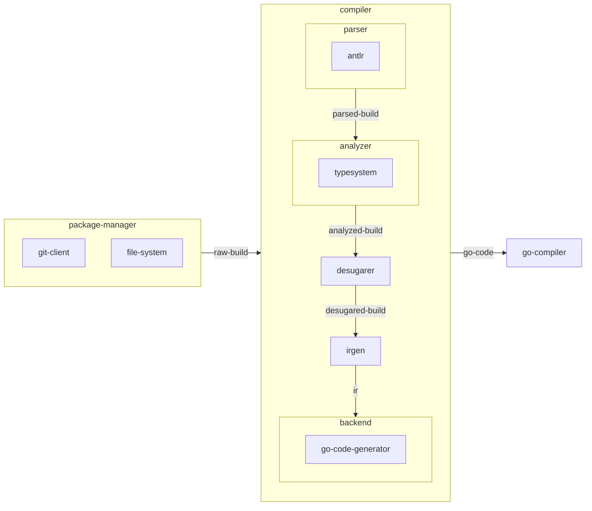
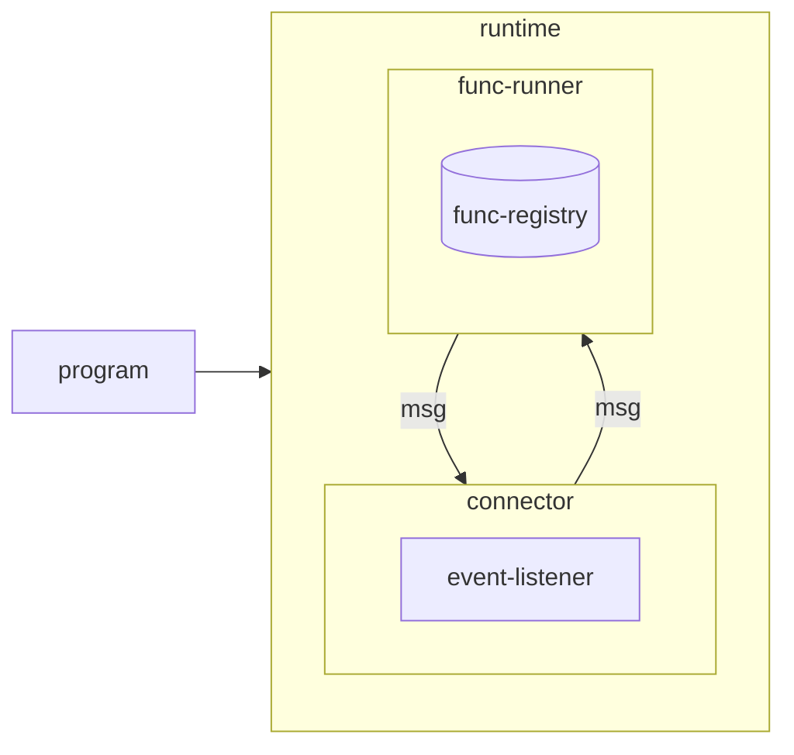
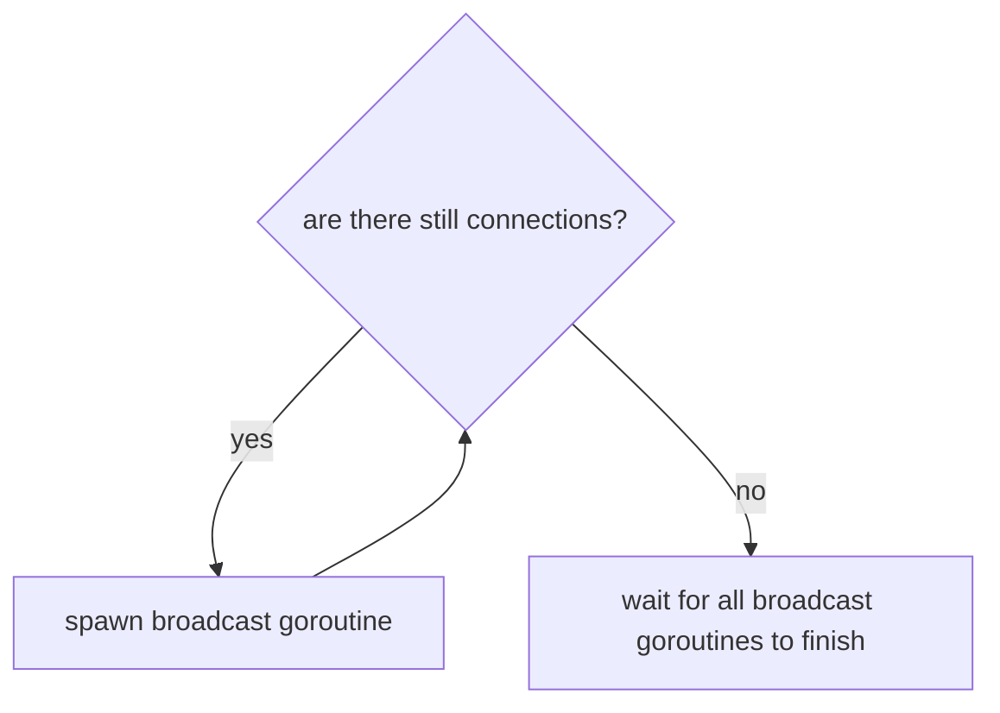
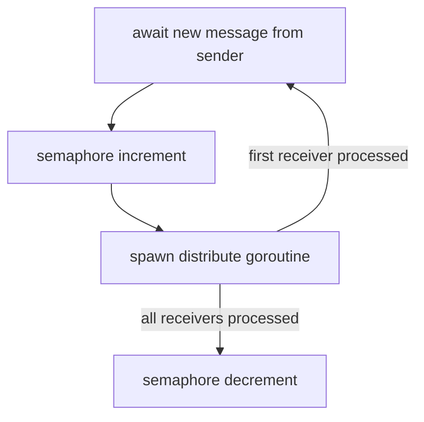
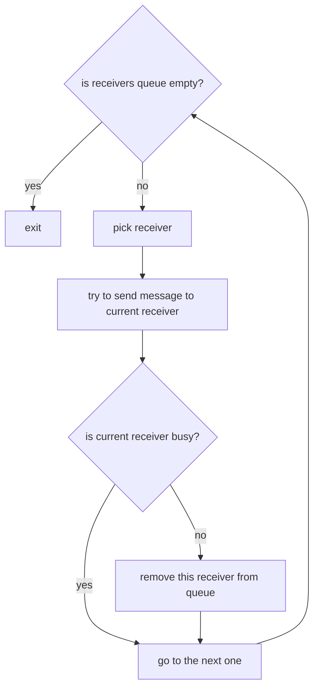
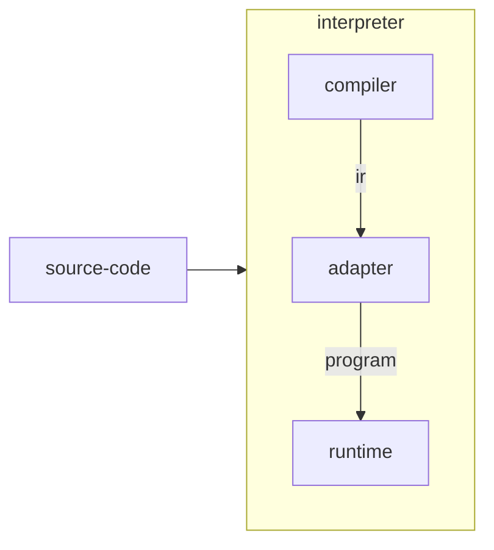
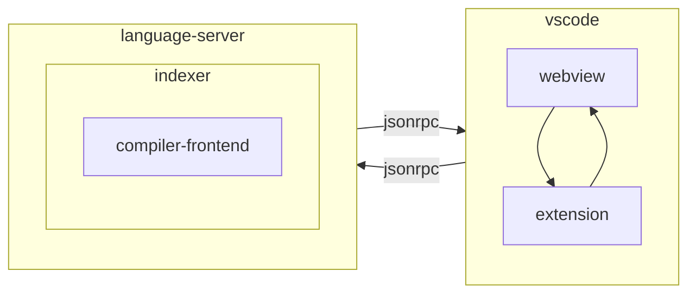

# ARCHITECTURE

## Compiler



## Runtime



### Connector Algorithm



#### Broadcast



#### Distribute



## Interpreter



## VSCode Extension



# Design Principles

Nevalang is built on a set of principles. They were rather naturally derived from the development process rather artificially created beforehand.

> WARNING: Language is under heavy development and these principles are not guarantees we can give you at the moment, but rather guiding stars for us to keep moving in the right direction

## Program must fail at startup or never

The idea is that most of the errors must be caught by compiler at compile time. And the rest of them, that are hard to catch (without sacrificing compiler's simplicity) are checked in runtime at startup.

If no errors were caught at compile time and startup - then the program is correct and must run successfully. Any (non-logical) error that occurred after startup must be threated like compiler bug.

## Runtime must be fast, flexible and unsafe

Runtime won't do any checks after startup. The program that runtime consumes must be correct. Program's correctness must be ensured by compiler. If there's a bug in compiler and runtime consumed invalid program - bad things can happen: deadlocks, memory leaks, freezes and crashes.

## Compiler directives must not be required

Language must allow to implement everything without using of compiler directives.

**Compiler directives are not always unsafe** (analyzer won't always validate their usage - that will make implementation more complicated) and thus must be used by language/stdlib developers or at _for users that know what they are doing_.

It's good for user to understand what compiler directives are and how syntax sugar use them under the hood though.

## There is interpreter (backend can be slow)

Compiler must be fast to the point where it generates IR. After that we have generating of target code (e.g. generating Go and then generating machine code with Go compiler) - that part ("backend") doesn't have to be fast. It's more important to keep it simple.

The reason for that is that we have an interpreter that is internally uses compiler (it's impossible to generate IR from invalid program due to lack of type information), but not the whole thing. Just to the point where it generates IR. That's the part of the compiler that is used for development/debugging purposes. That's where we need to be fast.

## There is visual programming

Once we build the good enough tool for visual programming we will switch from text based approach. Text will become supporting tool. To achieve this we must always keep in mind that what we do with the language must be easy to visualize in graph environment.

# Internal Implementation Q&A

## Why structures are not represented as Go structures?

It would take generating Go types dynamically which is either makes use of reflection or codegeneration (which makes interpreter mode impossible). Maps have their overhead but they are easy to work with.

## Why nested structures are not represented as flat maps?

Indeed it's possible to represent `{ foo {bar int } }` like `{ "foo/bar": 42 }`. The problem arise when when we access the whole field. Let's take this example:

```
types {
    User {
        pet {
            name str
        }
    }
}

...

$u.pet -> foo.bar
```

What will `foo.bar` actually receive? This design makes impossible to actually send structures around and allows to operate on non-structured data only.

## Why Go?

It's a perfect match. Go has builtin green threads, scheduler and garbage collector. Even more than that - it has goroutines and channels that are 1-1 mappings to FBP's ports and connections. Last but not least is that it's a pretty fast compiled language. Having Go as a compile target allows to reuse its state of the art standart library and increase performance for free by just updating the underlaying compiler.

## Why compiler operates on multi-module graph (build) and not just turns everything into one big module?

Imagine you have `foo.bar` in your code. How does compiler figures out what that actually is? In order to do that it needs to _resolve_ that _reference_. And this is how _reference resolution_ works:

First, find out what `foo` is. Look at the `import` section in the current file. Let's say we see something like:

```neva
import {
    github.com/nevalang/x/foo
}
```

This is how we now that `foo` is actually `github.com/nevalang/x/foo` imported package. Cool, but when version of the `github.com/nevalang/x` we should use? Well, to figure that out we need to look out current _module_'s _manifest_ file. There we can find something like:

```yaml
deps:
  - github.com/nevalang/x 0.0.1
```

Cool, now we now what _exactly_ `foo` is. It's a `foo` package inside of `0.0.1` version of the `github.com/nevalang/x` module. So what's the point of operating on a nested multi-module graph instead of having one giant module?

Now let's consider another example. Instead of depending on `github.com/nevalang/x` your code depends on `submodule` and that sub-module itself depends on `github.com/nevalang/x`

You still have that `foo.bar` in your code and your module still depends on `github.com/nevalang/x` module. But now you also depends on another `submod` sub-module that also depends on `github.com/nevalang/x`. But your module depends on `github.com/nevalang/x` of the `0.0.1` version and `submod` depends on `1.0.0`.

Now we have a problem. When compiler sees `foo.bar` in some file it does import lookup and sees `github.com/nevalang/x` and... does not know what to do. To solve this issue we need to lookup current module manifest and check what version `github.com/nevalang/x` _this current module_ uses. To do that we need to preserve the multi-module structure of the program.

One might ask can't we simply import things like:

```neva
import {
    github.com/nevalang/x@0.0.1
}
```

That actually could solve the issue. The problem is that now we have to update the source code _each time we update our dependency_. That's a bad solution. We simply made probramming harder to avoid working on a compiler. We can do better.

## Why `#bind` does not accept literals?

Indeed it would be handy to be able to do stuff like this:

```neva
nodes {
    #bind(str "hello world!")
    const Const<str>
}
```

This would make desugarer much simpler (no need to create all this virtual constants), and not just for const senders but for struct selectors too.

However, to implement this we need to be able to parse literals inside `irgen`. Right now we already introduce dependency for parsing entity references, but for arbitrary expressions we need the whole parser.

Of course, it's possible to hide actual parser implementation behind some kind of interface defined by irgen but that would make code more complicated. Besides, the very idea of having parser inside code-generator sounds bad. Parsing references is the acceptable compromise on the other hand.

## Why Analyzer knows about stdlib? Isn't it bad design?

At first there was a try to implement analyzer in a way that it only knows about the core of the language.

But turns out that some components in stdlib (especially `builtin` package, especially the ones that uses `#extern` and `#bind` directives) are actually part of the core of the language.

E.g. when user uses struct selectors like `foo.bar/baz -> ...` and then desugarer replaces this with `foo.bar -> structSelectorNode("baz") -> ...` (this is pseudocode) we must ensure that type of the `bar` is 1) a `struct` 2) has field `baz` and 3) `baz` is compatible with whatever `...` is. _This is static semantic analysis_ and that's is work for analyzer.

Actually every time we use compiler directive we depend on implicit contract that cannot be expressed in the terms of the language itself (except we introduce abstractions for that, which will make language more complicated). That's why we have to analyze such things by injecting knowledge about stdlib.

Designing the language in a way where analyzer has zero knowledge about stdlib is possible in theory but would make the language more complicated and would take much more time.

## Why desugarer comes after analyzer in compiler's pipeline?

Two reasons:

1. Analyzer should operate on original "sugared" program so it can found errors in user's source code. Otherwise found errors can relate to desugar implementation (compiler internals) which is not the compilation error but debug info for compiler developers. Finally it's much easier to make end-user errors readable and user-friendly this way.
2. Desugarer that comes before analysis must duplicate some validation because it's unsafe to desugar some constructs before ensuring they are valid. E.g. desugar struct selectors without knowing fir sure that outport's type is a valid structure. Also many desugaring transformations are only possible on analyzed program with all type expressions resolved.

Actually it's impossible to have desugarer before analysis. It's possible to have two desugarers - one before and one after. But that would make compiler much more complicated without visible benefits.

## Why union types are allowed for constants at syntax level?

You indeed can declare `const foo int | string = 42` and that won't make much sense. The problem it's not enough to restrict that at root level, you also have to recursively check every complex type like `struct`, `list` or `map`. And that is impossible to make at syntax level and require work in analyzer. This is could be done in the future when we cover more important cases.
