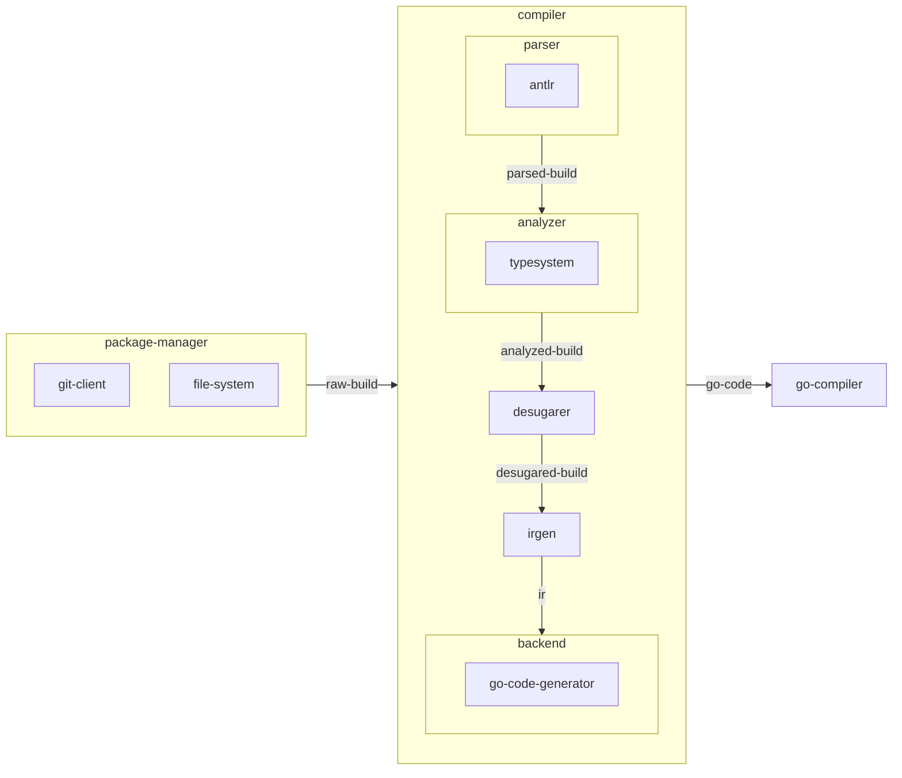
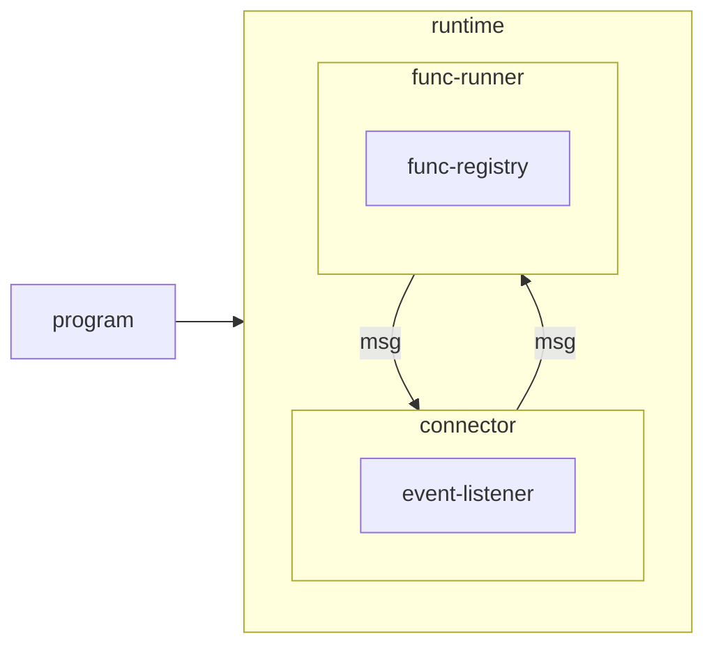
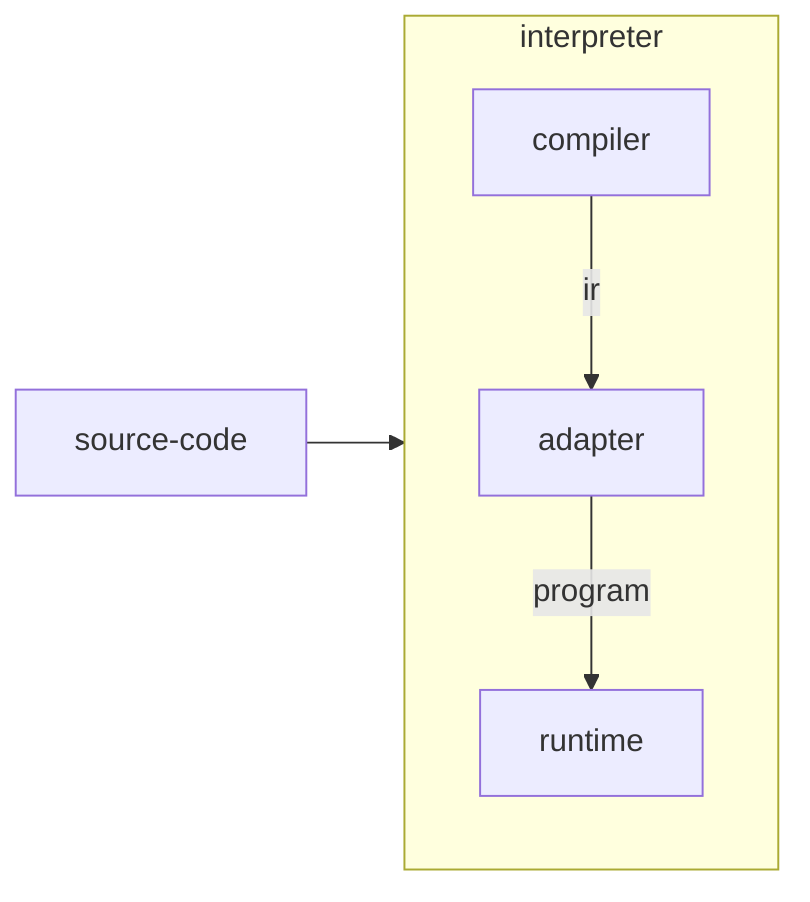
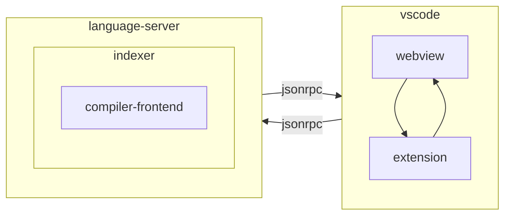

# ARCHITECTURE

## Compiler

```mermaid
flowchart LR
    package-manager -->|raw-build| compiler

    subgraph package-manager
        git-client
        file-system
    end

    subgraph compiler
        subgraph backend
            go-code-generator
        end

        parser -->|parsed-build| analyzer

        subgraph parser
            antlr
        end

        analyzer -->|analyzed-build| desugarer

        subgraph analyzer
            typesystem
        end

        desugarer -->|desugared-build| irgen

        irgen -->|ir| backend
    end

    compiler -->|go-code| go-compiler
```

## Runtime

```mermaid
flowchart LR
    program-->runtime

    subgraph runtime
        connector-->|msg|func-runner
        func-runner-->|msg|connector
    end

    subgraph connector
        event-listener
    end

    subgraph func-runner
        func-registry
    end
```

## Interpreter

```mermaid
flowchart LR
    source-code-->interpreter

    subgraph interpreter
        compiler-->|ir|adapter-->|program|runtime
    end
```

## VSCode Extension

```mermaid
flowchart LR
    language-server-->|jsonrpc|vscode
    vscode-->|jsonrpc|language-server

    subgraph language-server
        indexer
    end

    subgraph vscode
        webview-->extension
        extension-->webview
    end

    subgraph indexer
        compiler-frontend
    end
```
