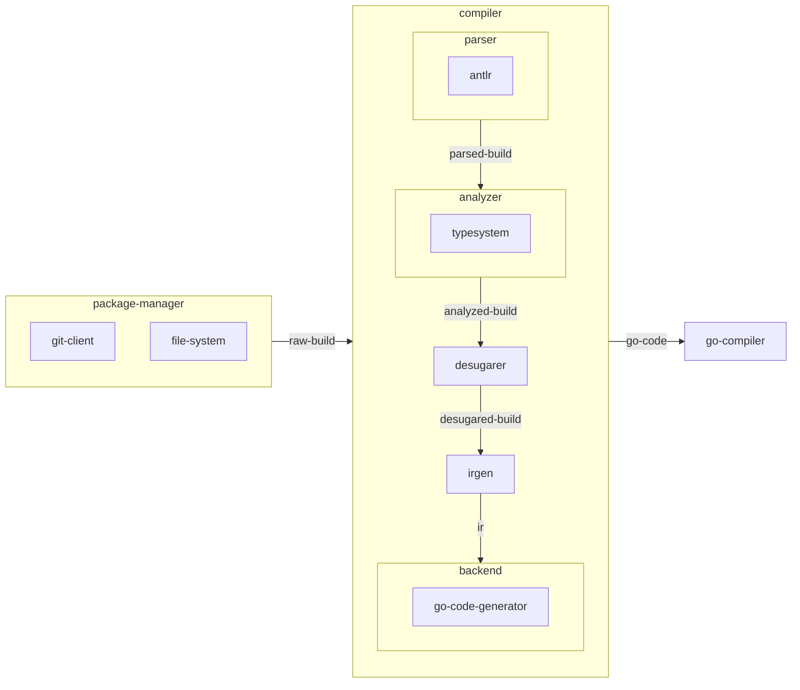
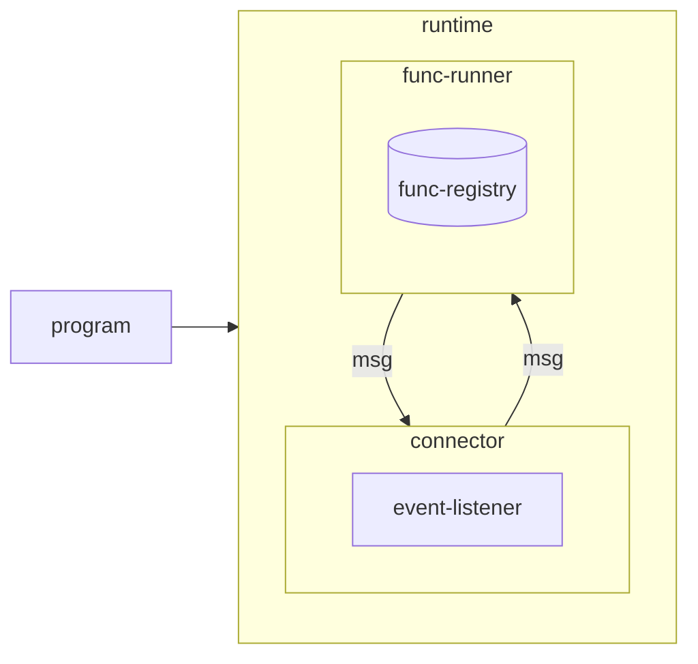
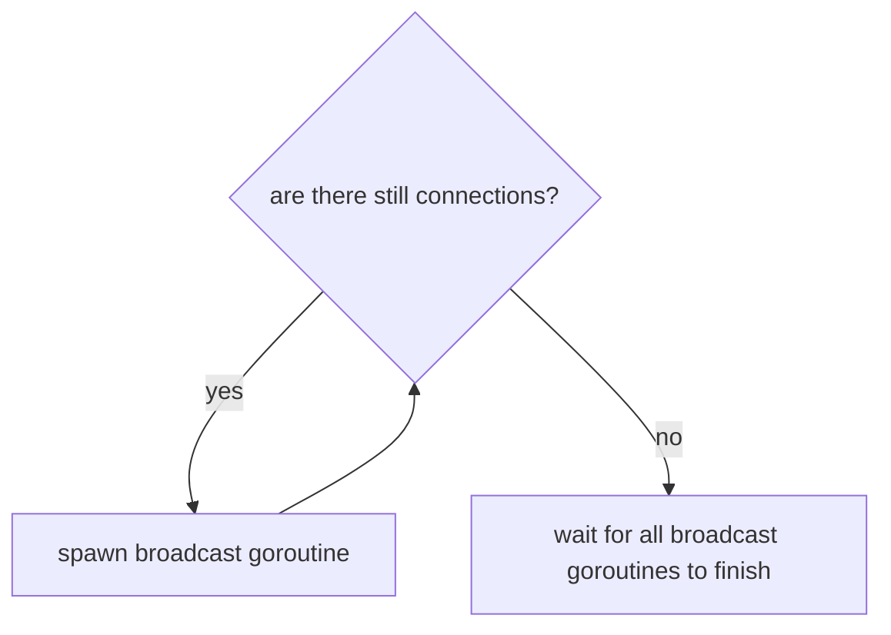
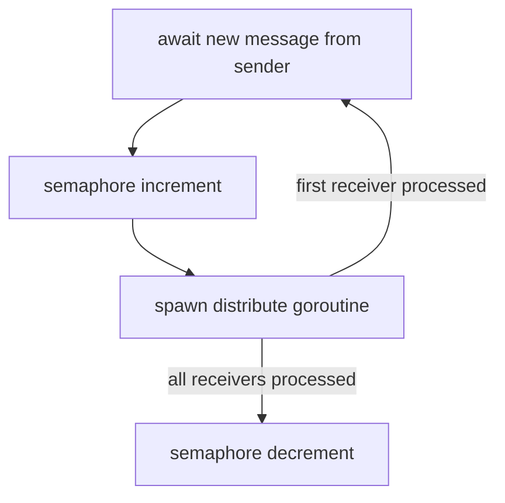
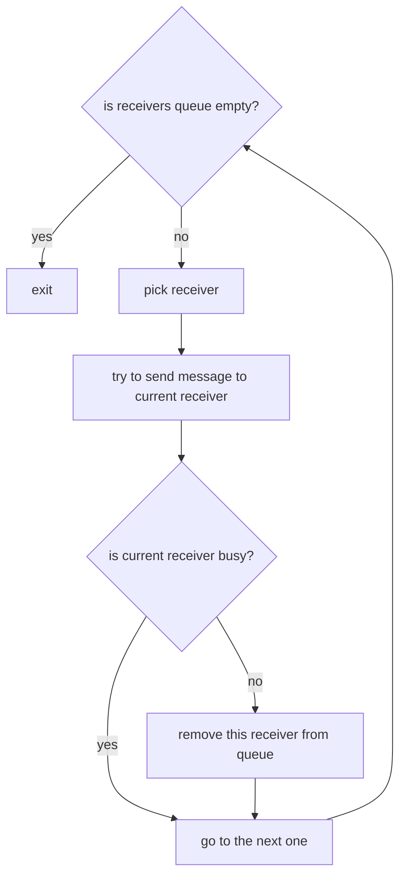
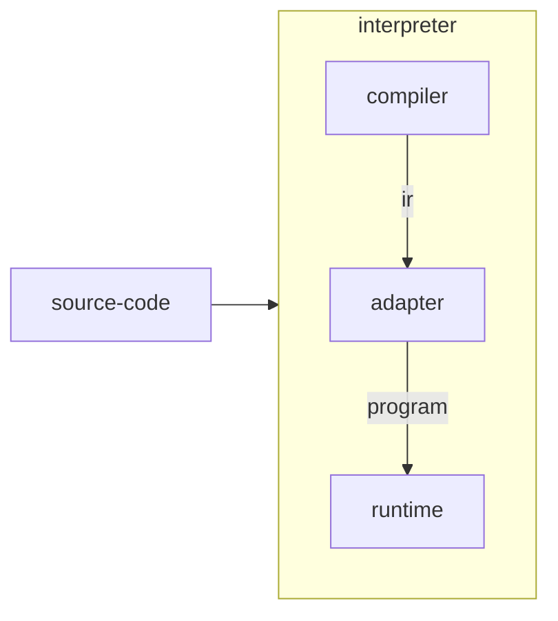
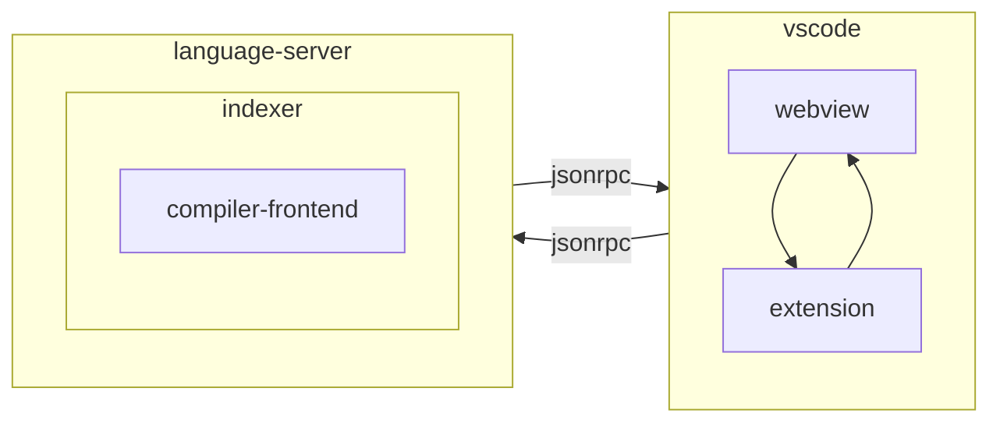

# ARCHITECTURE

## Compiler

## Runtime

### Connector Algorithm

#### Broadcast

#### Distribute

## Interpreter

## VSCode Extension

## Design Principles

Nevalang is built on a set of principles. They were rather naturally derived from the development process rather artificially created beforehand.

> WARNING: Language is under heavy development and these principles are not guarantees we can give you at the moment, but rather guiding stars for us to keep moving in the right direction

### Program must fail at startup or never

The idea is that most of the errors must be caught by compiler at compile time. And the rest of them, that are hard to catch (without sacrificing compiler's simplicity) are checked in runtime at startup.

If no errors were caught at compile time and startup - then the program is correct and must run successfully. Any (non-logical) error that occurred after startup must be threated like compiler bug.

### Runtime must be fast, flexible and unsafe

Runtime won't do any checks after startup. The program that runtime consumes must be correct. Program's correctness must be ensured by compiler. If there's a bug in compiler and runtime consumed invalid program - bad things can happen: deadlocks, memory leaks, freezes and crashes.

### Compiler directives must not be required

Language must allow to implement everything without using of compiler directives.

**Compiler directives are not always unsafe** (analyzer won't always validate their usage - that will make implementation more complicated) and thus must be used by language/stdlib developers or at _for users that know what they are doing_.

It's good for user to understand what compiler directives are and how syntax sugar use them under the hood though.

### There is interpreter (backend can be slow)

Compiler must be fast to the point where it generates IR. After that we have generating of target code (e.g. generating Go and then generating machine code with Go compiler) - that part ("backend") doesn't have to be fast. It's more important to keep it simple.

The reason for that is that we have an interpreter that is internally uses compiler (it's impossible to generate IR from invalid program due to lack of type information), but not the whole thing. Just to the point where it generates IR. That's the part of the compiler that is used for development/debugging purposes. That's where we need to be fast.

### There is visual programming

Once we build the good enough tool for visual programming we will switch from text based approach. Text will become supporting tool. To achieve this we must always keep in mind that what we do with the language must be easy to visualize in graph environment.
