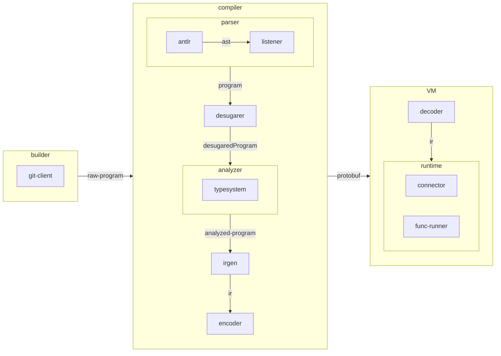
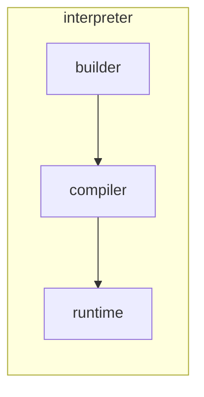

# ARCHITECTURE

## Production

```mermaid
flowchart LR
    builder-->|raw-program|compiler
    subgraph builder
        git-client
    end
    subgraph compiler
        parser-->|program|desugarer
        desugarer-->|desugaredProgram|analyzer

        subgraph parser
            antlr-->|ast|listener
        end

        subgraph analyzer
            typesystem
        end

        subgraph analyzer
            typesystem
        end

        analyzer-->|analyzed-program|irgen

        irgen-->|ir|encoder
    end

    compiler-->|protobuf|VM

    subgraph VM
        decoder-->|ir|runtime
        runtime
        subgraph runtime
            connector
            func-runner
        end

    end
```

## Development

```mermaid
flowchart LR
    subgraph interpreter
        builder-->compiler
        compiler-->runtime
    end
```

## VSCode Extension

See [web/ARCHITECTURE.md](./web/ARCHITECTURE.md)
