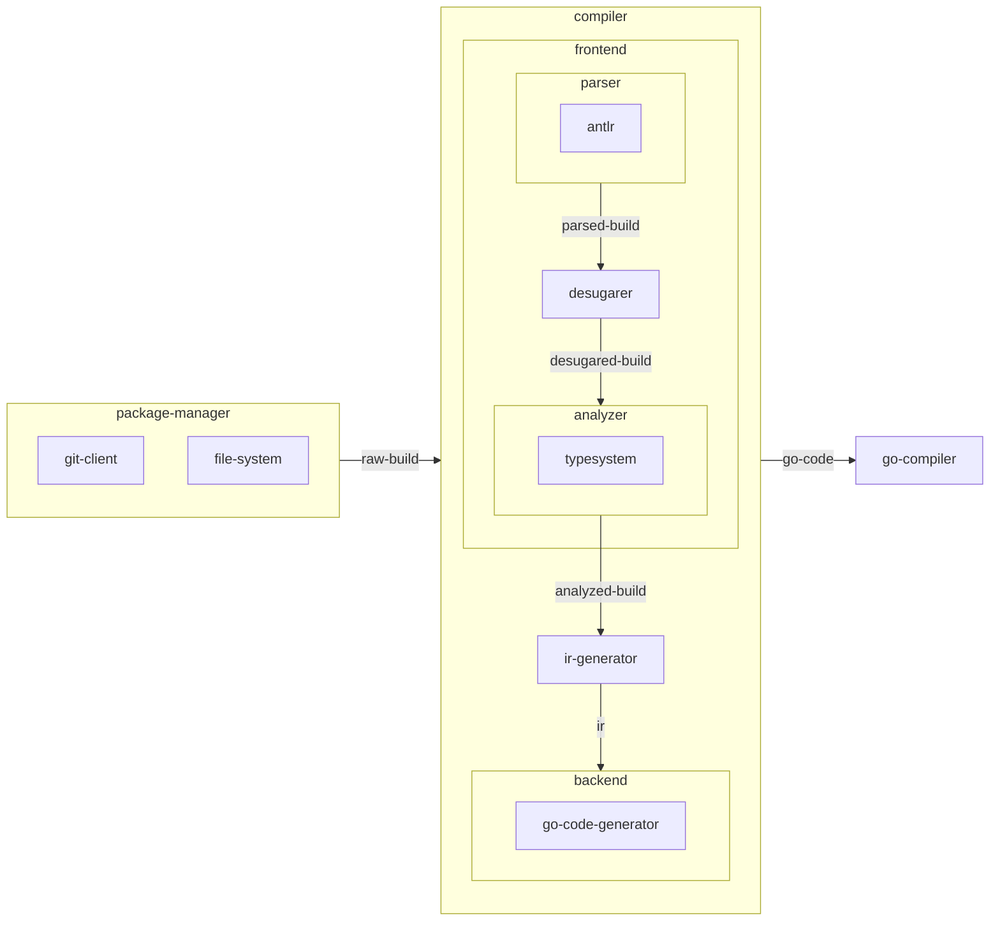

# ARCHITECTURE

## Executable Binary Compilation

```mermaid
flowchart LR
    package-manager -->|raw-build| compiler

    subgraph package-manager
        git-client
        file-system
    end

    subgraph compiler
        subgraph frontend
            parser
            desugarer
            analyzer
        end

        subgraph backend
            go-code-generator
        end

        parser -->|parsed-build| desugarer

        subgraph parser
            antlr
        end

        desugarer -->|desugared-build| analyzer

        subgraph analyzer
            typesystem
        end

        analyzer -->|analyzed-build| ir-generator

        ir-generator -->|ir| backend
    end

    compiler -->|go-code| go-compiler
```

## Interpreter mode

## VSCode Extension

See [web/ARCHITECTURE.md](./web/ARCHITECTURE.md)
