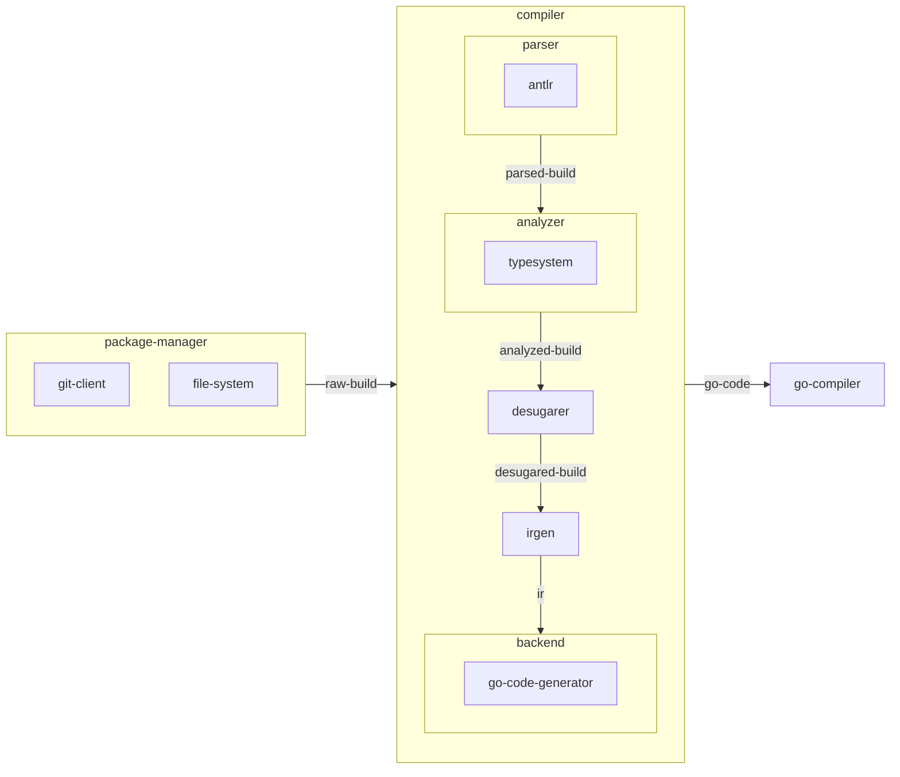
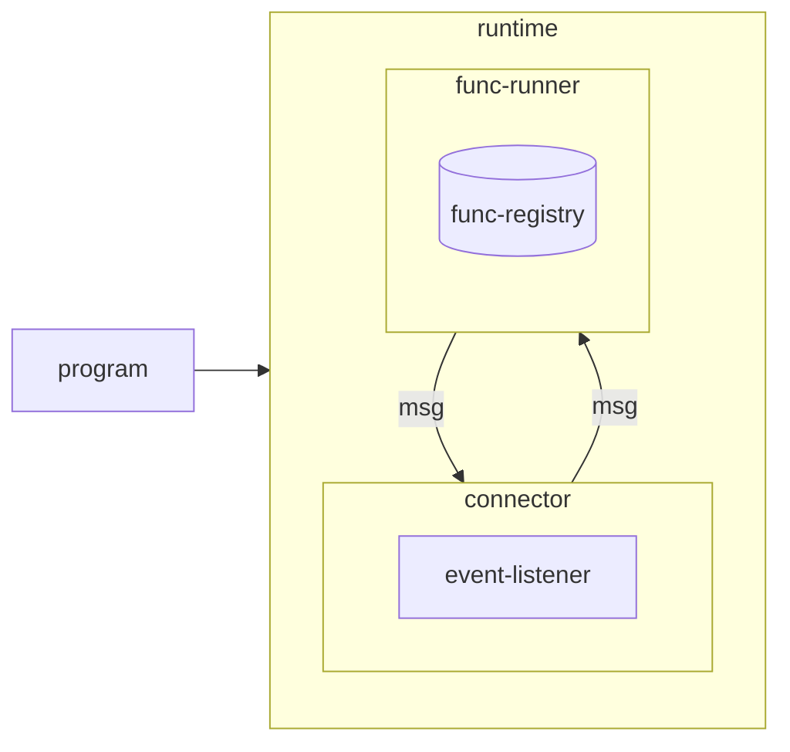
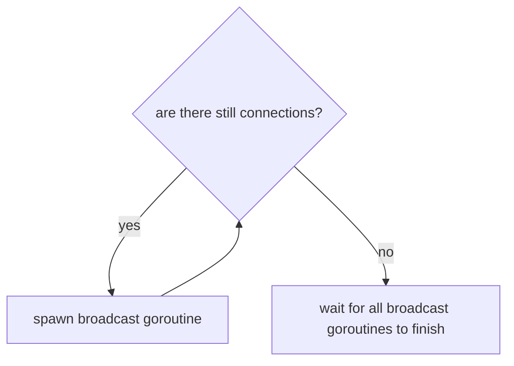
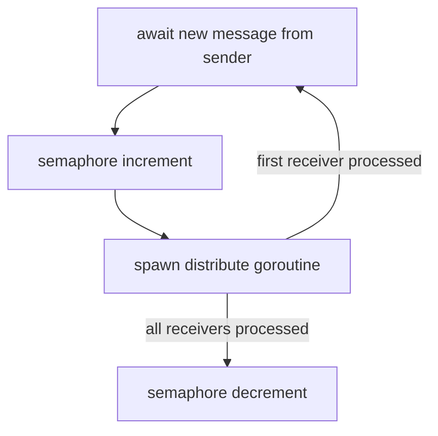
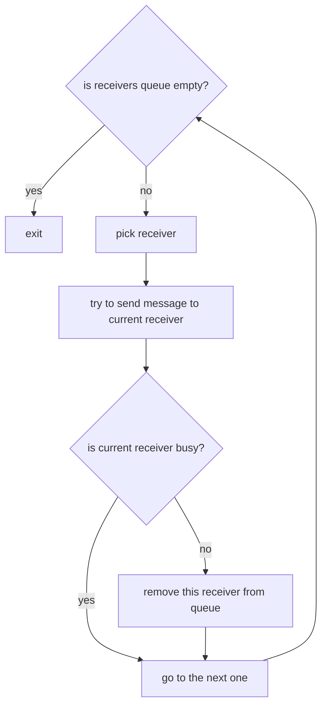
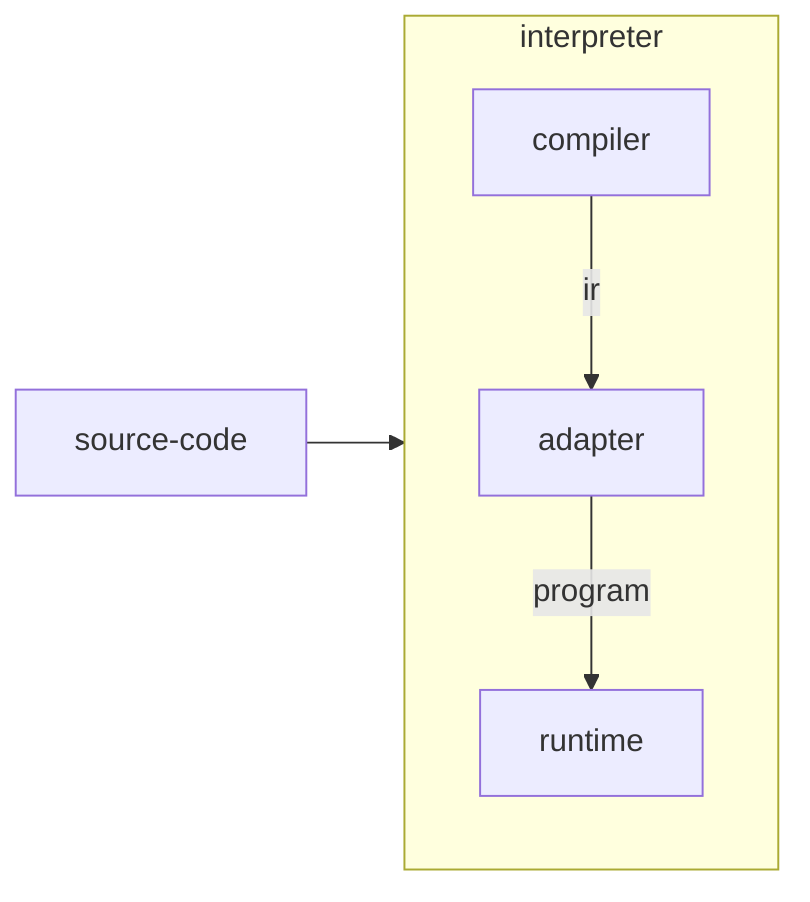
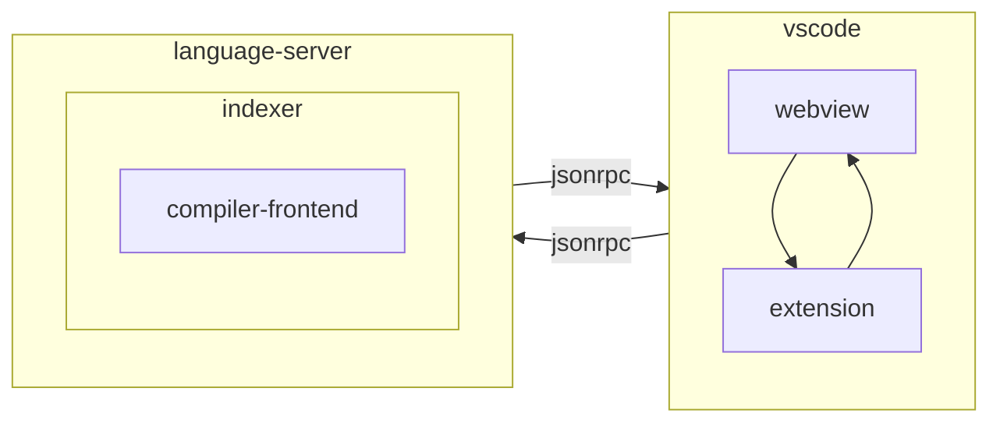

# Architecture

This document only keeps visual schemas of the core language components. For details see [CONTRIBUTING.md](./CONTRIBUTING.md).

## Compiler

## Runtime

### Connector Algorithm

> WARNING: Algorithm has changed, update is needed.

#### Broadcast

#### Distribute

## Interpreter

## VSCode Extension

