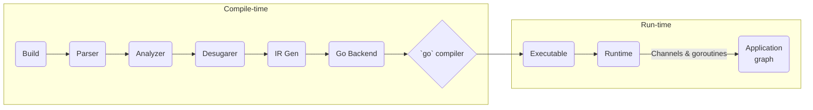
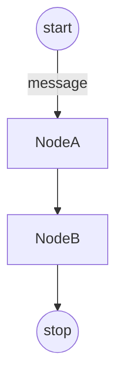

# Nevalang Project Context

> This document distills the essential architecture, design principles, and workflows of the Nevalang code-base. Reading it should give an experienced developer (or AI agent) enough context to navigate, maintain and safely extend the project without first having to reverse-engineer every package.

---

## 1 · High-Level Overview

**Nevalang** is a general-purpose _data-flow_ programming language. Instead of imperative control-flow, programs are built as graphs where immutable **messages** travel between **nodes** in parallel. After static analysis the compiler emits human-readable Go code which is then compiled to a single, zero-dependency executable (or WASM).

Main motivations:

- Pure data-flow & implicit parallelism.
- Hybrid text / visual programming (planned).
- Strong, _structural_ static typing with generics.
- Re-use of Go's world-class tool-chain & runtime.

### Top-Level Components

| Layer                        | Purpose                                       | Key packages / dirs                            |
| ---------------------------- | --------------------------------------------- | ---------------------------------------------- |
| **CLI**                      | `neva` command – build / run / fmt / pkg-mgmt | `cmd/neva`, `internal/cli`                     |
| **Language-Server**          | LSP server for editors                        | `cmd/lsp`, `cmd/lsp/indexer`, `cmd/lsp/server` |
| **Compiler**                 | Front-end → IR → Go backend                   | `internal/compiler/...`                        |
| **Runtime**                  | Executes compiled graphs at run-time          | `internal/runtime`                             |
| **Std-Library**              | Base & std components written **in Neva**     | `std/`                                         |
| **Tools / Tests / Examples** | Learning material & regression suites         | `examples/`, `e2e/`, `benchmarks/`             |

Major external deps: **Go ≥1.23**, [ANTLR4] for grammar, [`tliron/glsp`] for LSP scaffold.

---

## 2 · Architecture & Data-Flow



### 2.1 Front-End (Builder → Analyzer)

1. **Builder** (`internal/builder`)
   - Resolves _modules_ & manifests (`neva.yml`), downloads Git dependencies and injects stdlib.
2. **Parser** (`internal/compiler/parser`)
   - ANTLR grammar → AST.
3. **Analyzer** (`.../analyzer`)
   - Type-checking with structural sub-typing (`.../sourcecode/typesystem`).
4. **Desugarer**
   - Rewrites syntactic sugar into canonical core, injects implicit IO nodes, constants etc.

### 2.2 Middle-End (IR)

- `internal/compiler/ir` – language-agnostic graph representation used by code-generators.

### 2.3 Back-End (Go)

- `internal/compiler/backend/golang` turns IR into a small Go `main.go` plus vendored runtime files, then delegates to `go build`. Channels map 1-to-1 to Neva ports; messages are wrapped in `runtime.OrderedMsg` for traceability.

> Additional back-ends (e.g., LLVM, JS) could be plugged by implementing `Backend` interface.

### 2.4 Runtime

- `internal/runtime` provides generic message, port & scheduler abstractions. At program start it:
  - Spawns goroutines for every **function-call** (node instance).
  - Sends an empty `start` message, waits for `stop` and then cancels the shared `context.Context`.
- Native components are registered through **FuncCreator** objects in a global registry used during code-gen.

---

## 3 · Key Packages and Responsibilities

1. **`cmd/neva`** – thin wrapper that wires builder, compiler & CLI parsing.
2. **`internal/cli`** – user-visible commands (`build`, `run`, `new`, `get`, `fmt`, `version`).
3. **`cmd/lsp`** – JSON-RPC server; on change it builds the _front-end_ portion of the compiler to supply diagnostics & completion.
4. **`internal/builder`** – module graph assembly, dependency caching under `~/neva/{std,deps}`.
5. **`internal/compiler`** – orchestrates pipeline; sub-packages:
   - `parser` – grammar, tokens.
   - `desugarer` – sugar removal passes.
   - `analyzer` – semantic analysis.
   - `irgen` – AST → IR.
   - `backend/*` – code generation; current default is Go.
6. **`internal/runtime`** – message, port, queue abstractions + execution harness.
7. **`std/`** – reference components. Split by domain (`fmt`, `lists`, `streams`, `errors`, …). Two kinds:
   - _native_ (`#extern`) – implemented in Go runtime (e.g., math ops).
   - _normal_ – implemented in Neva itself.

---

## 4 · Major Workflows

### 4.1 Building & Running a Program

```text
neva build <path>   # or neva run <path>
 └─► builder.Build          – resolve modules
     └─► parser.Parse       – AST
         └─► analyzer.Analyze
             └─► desugarer.Desugar
                 └─► irgen.Generate
                     └─► backend.Go.Emit
                         └─► go build → executable
```

`neva run` additionally executes the binary and purges it afterwards.

### 4.2 IDE Diagnostics

1. Editor talks LSP.
2. `cmd/lsp` recreates front-end pipeline on file change.
3. Analyzer errors → LSP diagnostics.

### 4.3 Program Execution (Runtime)



At runtime every node is a goroutine reading from _in-ports_ and writing to _out-ports_ (unbuffered unless a dedicated buffer component is inserted). Tracing is implicit – every message carries its visited path.

---

## 5 · Extensibility Guidelines

- **New Native Component** – write Go func, expose via `#extern(name)` inside stdlib. Register func in runtime registry.
- **Custom Library** – create a module with manifest, publish via Git tag; other projects `neva get <url>`.
- **Additional Compiler Pass / Backend** – implement respective interface (`Desugarer`, `Analyzer`, `Backend`) and inject via DI into `cmd/neva`.
- **Editor tooling** – extend LSP indexer; most semantics already come from shared compiler front-end.

---

## 6 · Tricky Areas & Pitfalls

1. **Array Ports** – _no holes_ allowed; indices must be contiguous from 0. Components cannot read their own array-inport slots directly.
2. **Deadlocks** – unbuffered channels + cycles can stall; use dedicated buffer components.
3. **Constant Senders** – become infinite loops unless synchronised; prefer chained connections (`:start -> $msg -> node`).
4. **Module Paths** – entry module is addressed as `@`; forgetting manifest or wrong working dir breaks import resolution.
5. **Desugarer Edge-Cases** – implicit IO nodes mean actual connection set is larger than user code; be careful when debugging IR.
6. **Parser Grammar Issues** – ANTLR error messages can be misleading; line/column numbers may not match actual error location. Use systematic debugging with "Processing file:" messages to identify actual error sources.
7. **Interface Syntax** – interfaces without type parameters should NOT use `<>`; only use `<>` when you actually have type parameters.
8. **Tagged Union Syntax** – use `union { FieldName type, AnotherField type }` syntax; avoid pipe characters (`|`) which are not valid.
9. **Tagged Union Literals** – use `TypeName::Variant(value)` syntax, not direct function calls like `Variant(value)`.
10. **Compiler Directives** – `#extern` directives take single identifiers only, not comma-separated lists.

---

## 7 · Testing & Development

- **Unit / e2e** – under `e2e/`; each folder contains `.neva` program, `neva.yml` and Go test harness.
- **Benchmarks** – see `benchmarks/message_passing`.
- **CI** – GitHub Actions (`.github/workflows/{test,lint}.yml`).
- **Local Dev**
  ```bash
  make test     # run Go linters & tests
  make build    # cross-compile CLI for all platforms
  go run ./cmd/neva build examples/hello_world
  ```
- **Debugging Compiler** – set `NEVA_DEBUG=1` (planned) or step through `internal/compiler/*`.
- **Debugging Runtime** – enable trace file (`neva build --trace`) then inspect message paths.
- **Debugging Parser** – ANTLR error messages can be misleading; check grammar file (`internal/compiler/parser/neva.g4`) for correct syntax rules.

---

## 8 · References & Further Reading

- Project [README](./README.md) – vision & feature matrix.
- [ARCHITECTURE.md](./ARCHITECTURE.md) – high-level diagrams.
- [docs/](./docs) – language tutorial, book & FAQ.
- Compiler internals – `internal/compiler/*.go`.
- Runtime internals – `internal/runtime/*.go`.
- Standard library – `std/` plus docs in `docs/book/*`.

> Missing context? Add it here and commit – **CONTEXT.md** should remain the single source of truth for future contributors and AI assistants.
