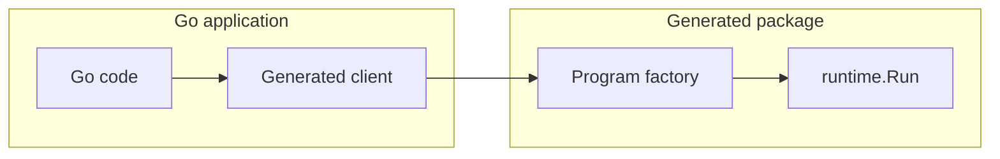

# Go → Neva Package Mode Design

## quick example first (nevalang)

before details, here is a small nevalang package with a multi-port export. this is what the go package will target.

```
neva.yml
userfmt/
  userfmt.neva
```

```neva
// userfmt.neva
// exported component with exactly one input struct and one output struct
type FormatUserInput struct {
    name string
    age int
    active bool
}
type FormatUserOutput struct {
    greeting string
    summary string
}
pub def FormatUser(input FormatUserInput) (output FormatUserOutput) {
  // implementation can be any neva graph; ports define the external api
}
```

the go backend maps the single input port to the start struct message and the single output port to the stop struct message. go-facing types stay idiomatic (plain structs with string/int/bool fields) and conversion happens in generated wiring.

## Goals & Constraints

* Generate Go packages that feel idiomatic to Go developers so Neva programs can be invoked from Go with the same ease as calling ordinary functions.
* Do not require changes to the Neva runtime or stdlib. All custom interop code must live in generated files or user packages.
* Reuse the existing Go backend so we continue to emit ready-to-run Go code without runtime unmarshalling or reflection.
* Keep performance overhead low by reusing `runtime.Program` execution semantics and avoiding extra goroutines.
* Leave room for future hooks (e.g. swapping the runtime implementation) without forcing that surface into the initial MVP.

This iteration deliberately focuses on **Go → Neva**. Calling user Go code from Neva will be revisited once the package flow proves out.

## Current Backend Behaviour

Running `neva build --target=go` today produces an executable:

1. The compiler builds IR for a single entry-point program and records the list of `FuncCall`s plus channel identifiers.
2. `tpl.go` renders `main.go`, wiring those calls into one `runtime.Program` literal with `Start`/`Stop` ports.
3. The backend copies `internal/runtime/**` and related support files next to the entry point so the emitted Go compiles in isolation.

Package mode keeps this pipeline but emits library-friendly files instead of a `main` package.

## CLI Surface

Package mode extends the existing command without inventing new boolean flags:

```bash
neva build --target=go --target-go-mode=pkg --output=./internal/gen ./pkg/userfmt
```

* `--target=go` continues to select the Go backend.
* `--target-go-mode` accepts `executable` (current default) or `pkg`.
* `--output` points to the directory where generated Go code is written.
* The final positional argument stays the path to the Neva **package** being compiled.

`go:generate` directives can reference the same command; the resulting files integrate with standard tooling like `goimports` and `go list`.

## Exported Component Handling

Executable builds assume one entry point. Library emission must surface every `pub def` exposed by the package. The compiler performs three extra steps when `--target-go-mode=pkg` is selected:

1. **Export discovery.** We already mark exported components in the IR. Package mode collects each export and records its inport/outport schemas.
2. **Wrapper synthesis.** For every export the backend fabricates a tiny IR program that maps the component’s public ports into the `Start`/`Stop` handshake expected by `runtime.Run`. Each wrapper:
   * Treats all input ports as the payload delivered on `Start`.
   * Treats output ports as the payload observed on `Stop`.
   * Rejects components lacking either inputs or outputs (they cannot be sensibly expressed as a call-return function). Support for more exotic shapes can be layered in later.
3. **Template reuse.** The existing Go template runs once per wrapper, producing a `runtime.Program` literal identical to what the executable backend would emit.

This design intentionally presents exported components as *call/return* style APIs to Go code while preserving dataflow inside the Neva program. It sacrifices direct streaming semantics for the first iteration but massively simplifies interop: the host submits one request, waits for one response, and can run multiple requests concurrently by creating independent runtimes.

## start/stop ports and struct bundling

`runtime.Program` (and `ir.Program`) expose exactly one input port (`Start`) and one output port (`Stop`). exported components must therefore have one input and one output port. to carry multiple values, each port is a neva struct with fields for each logical value:

- **input → start struct**: a single input port whose value is a struct; field names mirror logical input names; field values are encoded `runtime.Msg` primitives.
- **output ← stop struct**: a single output port whose value is a struct; field names mirror logical output names; values are decoded back into go primitives.

the generated go api stays strongly-typed and simple (plain structs with fields), while the wiring helpers in `programs.go` perform the conversion to/from neva structs by building parallel `names []string` and `fields []runtime.Msg` slices.

## Example Program Factory

generated factories create the same wiring as today’s executable template. below is the shape for the exported `FormatUser` component (single input/output, both structs) without any extra ports wrapper, since `runtime.Program` already exposes `Start` and `Stop`:

```go
package gen

import "github.com/nevalang/neva/internal/runtime"

func newFormatUserProgram() runtime.Program {
    interceptor := runtime.ProdInterceptor{}

    startChan := make(chan runtime.OrderedMsg)
    stopChan := make(chan runtime.OrderedMsg)

    startPort := runtime.NewSingleOutport(
        runtime.PortAddr{Path: "in", Port: "start"},
        interceptor,
        startChan,
    )
    stopPort := runtime.NewSingleInport(
        stopChan,
        runtime.PortAddr{Path: "out", Port: "stop"},
        interceptor,
    )

    funcCalls := []runtime.FuncCall{
        {
            Ref: "user.format_user",
            IO: runtime.IO{
                In: runtime.NewInports(map[string]runtime.Inport{
                    "input": runtime.NewInport(nil, runtime.NewSingleInport(startChan, runtime.PortAddr{Path: "in/user.format_user", Port: "input"}, interceptor)),
                }),
                Out: runtime.NewOutports(map[string]runtime.Outport{
                    "output": runtime.NewOutport(runtime.NewSingleOutport(runtime.PortAddr{Path: "out/user.format_user", Port: "output"}, interceptor, stopChan), nil),
                }),
            },
            Config: nil,
        },
    }

    return runtime.Program{
        Start:     startPort,
        Stop:      stopPort,
        FuncCalls: funcCalls,
    }
}
```

the host-facing client never touches channel wiring directly — it receives the `runtime.Program` and uses its public `Start`/`Stop` ports via `runtime.Call`.

## Generated Package Layout

given `--output=./internal/gen`, the backend emits a single go package rooted exactly at `internal/gen` with package name `gen`, plus the runtime copy it already ships today:

```
internal/gen/
  runtime/…         # identical to executable mode
  api.go            # one free function per export calling runtime.Call
  programs.go       # factories like newFormatUserProgram + wiring helpers
```

all files start with the conventional `// Code generated by neva. DO NOT EDIT.` comment. host code imports `internal/gen`; the runtime copy remains an implementation detail.

## mvp api and type strategy

for the initial package mode, the api is untyped: free functions accept and return `runtime.Msg`. this keeps codegen simple (no type mapping logic) and matches the runtime representation. a later iteration can add optional typed adapters and a typed client that map to go primitives.

## Go → Neva Workflow

### step-by-step

1. **generate the package.** run `neva build --target=go --target-go-mode=pkg --output=./internal/gen ./pkg/userfmt`.
2. **import the package.** in go code: `import "example.com/app/internal/gen"` and `import "github.com/nevalang/neva/internal/runtime"`.
3. **call an export (free function).**
   ```go
   out, err := gen.FormatUser(
       ctx,
       runtime.NewStructMsg(
           []string{"name", "age", "active"},
           []runtime.Msg{
               runtime.NewStringMsg("Ada"),
               runtime.NewIntMsg(37),
               runtime.NewBoolMsg(true),
           },
       ),
   )
   if err != nil { /* handle */ }
   fmt.Println(out.Struct().Get("greeting").Str())
   fmt.Println(out.Struct().Get("summary").Str())
   ```
4. **handle the result.** outputs are returned as a `runtime.Msg` (struct) mirroring the neva output port.

### mvp api snippet (free function)

```go
package main

import (
    "context"
    gen "example.com/app/internal/gen"
    "github.com/nevalang/neva/internal/runtime"
)

func main() {
    ctx := context.Background()
    out, err := gen.FormatUser(
        ctx,
        runtime.NewStructMsg(
            []string{"name", "age", "active"},
            []runtime.Msg{
                runtime.NewStringMsg("Ada"),
                runtime.NewIntMsg(37),
                runtime.NewBoolMsg(true),
            },
        ),
    )
    if err != nil {
        panic(err)
    }
    _ = out
}
```

### typed client example (post-mvp)

the following client-based, typed-struct api is a future enhancement and not part of the mvp:

```go
// not implemented in mvp
type Client struct { /* ... */ }
type FormatUserInput struct { /* ... */ }
type FormatUserOutput struct { /* ... */ }
```

<!-- echo examples removed to focus on the struct-on-single-port model -->

### Mermaid overview



## Limitations & Trade-offs

* exported components behave like rpc endpoints: the host waits for completion before receiving a response. streaming between go and neva is not directly exposed yet.
* each invocation spins up its own program instance. sharing a runtime across multiple calls may be considered later; the mvp keeps the api simple.
* components must currently expose at least one inport and one outport. support for sink/source shapes can be added once we define the expected go-side semantics.

## error handling
- no errors are ignored; all helper functions return errors and callers decide how to handle them.
- `context.Context` governs lifetime.

## implementation plan

1. **cli plumbing.** add the `pkg` mode flag parsing while leaving executable behaviour untouched.
2. **export collection.** thread export metadata through the go backend entry point.
3. **wrapper generation.** synthesize wrapper programs and reuse `tpl.go` to materialise the `runtime.Program` literals.
4. **template additions.** introduce library templates for `api.go` and `programs.go` (which also contains wiring helpers) that consume the existing `templateData`.
5. **end-to-end tests.** generate a package from a sample neva project, `go build` it, and execute a smoke test that calls the exported component from go.

## Performance & Tooling Notes

* No runtime unmarshalling is performed; generated code sends `runtime.Msg` values straight over the compiled channels.
* The client API mirrors conventional Go constructors and leaves room to add `NewClientWithRuntime` later without breaking callers.
* The output tree is a normal Go package, so `go mod tidy`, `go test`, and IDE integrations behave as expected.

# implementation guide for ai agent

this guide is a step-by-step for completing go → neva package mode, aligned with the current codebase state.

## current state (as of branch go_interop)
- cli:
  - `--target-go-mode` flag is plumbed; accepts `executable` (default) or `pkg`.
- irgen:
  - `Generator.GenerateForComponent(build, pkgName, componentName)` exists and produces an `ir.Program` rooted at the exported component (ports usage from the component interface).
- go backend:
  - `ModePackage` is defined but not implemented in `Emit` (currently panics).
  - executable template and wiring helpers exist.
- tests:
  - e2e `e2e/cli/build_with_go_pkg_mode/e2e_test.go` expects:
    - generated files: `api.go`, `programs.go`
    - public free function per export (e.g. `Print42(ctx, runtime.Msg) (runtime.Msg, error)`).
    - factory `new<Export>Program()` behind the api.
- analyzer:
  - analyzer already supports library analysis when `mainPkgName == ""` (skips main-specific checks). cli currently always passes a non-empty main, so pkg-mode must call analyzer in library mode.

## target mvp behavior
- `neva build --target=go --target-go-mode=pkg --output=./gen/<pkg> ./src[/subpkg]`
- emit a go package:
  - `programs.go`: one `new<Export>Program() runtime.Program` per exported component.
  - `api.go`: one top-level function per export calling `runtime.Call(ctx, prog, funcs.NewRegistry(), start runtime.Msg) (stop runtime.Msg, error)`.
  - runtime is copied under `runtime/` as in executable mode.
- constraints:
  - exported component must have exactly one inport and one outport; both carry a struct (for now we accept/return `runtime.Msg` directly).
  - one request → one response (no streaming).

## step-by-step implementation

1) add package-mode analysis path (no main)
- goal: analyze/desugar a package without enforcing `Main` or banning public entities.
- implement one of:
  - a) add `AnalyzeBuildForPackage(build, pkgPath)` (no `Main` checks, allow public entities in that package).
  - b) extend `AnalyzeBuild` with a mode param; in pkg-mode branch, skip `mainSpecificPkgValidation`.
- update `internal/cli/build.go` to call the package-mode analyzer when `--target-go-mode=pkg`.

2) export discovery for the selected package
- input: analyzed build + target package path (`FrontendResult.MainPkg`).
- iterate package entities and collect public component entities:
  - source: `internal/compiler/sourcecode.Package.Entities()` → `Entity{IsPublic, Kind==ComponentEntity}`.
- validate each export:
  - exactly one inport and one outport (`component.Interface.IO.In`/`Out` length == 1).
  - for mvp, accept any underlying types; downstream we treat them as `runtime.Msg`.
- produce a list of `exports = [{name, interface}]`.

3) wrapper ir per export
- for each export `E`, call:
  - `irgen.GenerateForComponent(build, pkgName, E)`.
- this yields an `ir.Program` with ports named as in the component interface (not `start`/`stop`) — we will use a dedicated pkg template that wires these as `runtime.Program{Start, Stop}` appropriately.

4) implement go backend package emission
- create new method in `internal/compiler/backend/golang` (non-interface):
  - `func (b Backend) EmitPackage(dst string, wrappers map[string]*ir.Program, trace bool) error`.
- responsibilities:
  - for each export, compute `addrToChanVar` and `FuncCalls` via existing helpers (`buildPortChanMap`, `buildFuncCalls`).
  - render `programs.go` and `api.go` using new templates (see next step).
  - copy `internal/runtime/**` into `dst/runtime/**` via existing `insertRuntimeFiles`.
  - write files via `compiler.SaveFilesToDir`.

5) add templates for pkg mode
- `programs.go` template (one factory per export):
  - for each export E:
    - define local channels inside `newEProgram()` from `ChanVarNames`.
    - create `interceptor` (debug or prod based on `trace` param passed into EmitPackage).
    - construct `startPort` and `stopPort` using the actual in/out path/port names produced by `ir` for this export (not hardcoded `in:start`/`out:stop`).
    - build `[]runtime.FuncCall` with maps created by `buildFuncCalls`.
    - return `runtime.Program{Start, Stop, FuncCalls}`.
- `api.go` template (one free function per export):
  - imports: `context`, `github.com/nevalang/neva/internal/runtime`, `github.com/nevalang/neva/internal/runtime/funcs`.
  - for each export E:
    - `func E(ctx context.Context, start runtime.Msg) (runtime.Msg, error) { prog := newEProgram(); return runtime.Call(ctx, prog, funcs.NewRegistry(), start) }`.
- note: for mvp we keep the api untyped (`runtime.Msg`); typed structs and a `Client` type can be added later without breaking this surface.

6) integrate cli flow for pkg mode
- in `internal/cli/build.go`:
  - when `--target-go-mode=pkg`:
    - run frontend as usual to build module graph and determine target package path.
    - call analyzer in library mode `AnalyzeBuild(build, "")` to skip main checks.
    - run desugarer on the analyzed build.
    - perform step (2) export discovery on the selected package.
    - for each export, run (3) to get wrapper ir via `GenerateForComponent`.
    - instantiate `golang.NewBackend(golang.ModePackage)` and call `EmitPackage(outputDir, wrappers, trace)`.

7) enforce constraints and errors
- if any export lacks exactly one inport or one outport: return a clear error (point to entity location).
- if no exports found: return a clear error suggesting to add `pub def` to the target package.
- keep errors surfaced via cli.

8) tests
- e2e:
  - keep `e2e/cli/build_with_go_pkg_mode`:
    - ensure it creates exports in a package acceptable by package-mode analyzer.
    - assert files `api.go`, `programs.go` exist.
    - `go build ./...` succeeds with `-replace github.com/nevalang/neva=../`.
    - `go run .` prints expected output.
- unit:
  - export discovery returns expected set.
  - wrapper generation uses exact in/out port names.
  - templates compile minimal stubs (string-compare or `go build` in a temp module).

9) future incremental improvements (post-mvp)
- generate typed request/response structs mirroring neva struct fields.
- add a `client` type with per-export methods.
- allow 0-in/1-out (source) and 1-in/0-out (sink) shapes with defined go semantics.
- add option to share a runtime across calls.
- optional tracing hook/config in `newclient`.

## implementation notes
- reuse existing wiring helpers (`buildPortChanMap`, `buildFuncCalls`) to avoid duplicating logic.
- program factories should declare channel variables locally; executable template’s top-level channel vars don’t apply.
- do not change the compiler backend interface; pkg mode is invoked by cli using `EmitPackage`.
- analyzer changes must avoid regressing executable mode (gate by explicit pkg-mode path only).
