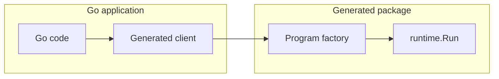

# Go → Neva Package Mode Design

## quick example first (nevalang)

before details, here is a small nevalang package with a multi-port export. this is what the go package will target.

```
neva.yml
userfmt/
  userfmt.neva
```

```neva
// userfmt.neva
// exported component with exactly one input struct and one output struct
type FormatUserInput struct {
    name string
    age int
    active bool
}
type FormatUserOutput struct {
    greeting string
    summary string
}
pub def FormatUser(input FormatUserInput) (output FormatUserOutput) {
  // implementation can be any neva graph; ports define the external api
}
```

the go backend maps the single input port to the start struct message and the single output port to the stop struct message. go-facing types stay idiomatic (plain structs with string/int/bool fields) and conversion happens in generated wiring.

## Goals & Constraints

* Generate Go packages that feel idiomatic to Go developers so Neva programs can be invoked from Go with the same ease as calling ordinary functions.
* Do not require changes to the Neva runtime or stdlib. All custom interop code must live in generated files or user packages.
* Reuse the existing Go backend so we continue to emit ready-to-run Go code without runtime unmarshalling or reflection.
* Keep performance overhead low by reusing `runtime.Program` execution semantics and avoiding extra goroutines.
* Leave room for future hooks (e.g. swapping the runtime implementation) without forcing that surface into the initial MVP.

This iteration deliberately focuses on **Go → Neva**. Calling user Go code from Neva will be revisited once the package flow proves out.

## Current Backend Behaviour

Running `neva build --target=go` today produces an executable:

1. The compiler builds IR for a single entry-point program and records the list of `FuncCall`s plus channel identifiers.
2. `tpl.go` renders `main.go`, wiring those calls into one `runtime.Program` literal with `Start`/`Stop` ports.
3. The backend copies `internal/runtime/**` and related support files next to the entry point so the emitted Go compiles in isolation.

Package mode extends this pipeline: instead of generating one main program, it discovers all exported components, generates an IR program for each export, and emits library-friendly files (`api.go`, `programs.go`) in a reusable Go package. Both modes share the same wiring logic and runtime.

## CLI Surface

Package mode extends the existing command without inventing new boolean flags:

```bash
neva build --target=go --target-go-mode=pkg --output=./internal/gen ./pkg/userfmt
```

* `--target=go` continues to select the Go backend.
* `--target-go-mode` accepts `executable` (current default) or `pkg`.
* `--output` points to the directory where generated Go code is written.
* The final positional argument stays the path to the Neva **package** being compiled.

`go:generate` directives can reference the same command; the resulting files integrate with standard tooling like `goimports` and `go list`.

## Exported Component Handling

Executable builds assume one entry point. Library emission must surface every `pub def` exposed by the package. the only requirement for a neva component to be exposed to go is that it is exported (`pub`). port names do not matter, their amount does not matter, and ports themselves do not have to be structs — they can be of any neva type. the backend normalizes any shape via a synthesized bundling wrapper (see below). for the mvp we still require at least one input and one output to preserve call/return semantics. the compiler performs three extra steps when `--target-go-mode=pkg` is selected:

1. **Export discovery.** We already mark exported components in the IR. Package mode collects each export and records its complete set of inports and outports (no single-port restriction).
2. **Wrapper synthesis (multi-port bundling).** For every export the compiler fabricates a synthetic component that has exactly one input and one output port, both structs. The wrapper unpacks the input struct into the original component’s input ports and re-bundles all outputs into the output struct:
   * All input ports → fields of the wrapper’s input struct delivered on `Start`.
   * All output ports ← fields of the wrapper’s output struct observed on `Stop`.
   * Components lacking either inputs or outputs are rejected in the mvp (call/return). Support for more exotic shapes can be layered in later.
3. **Template reuse.** The existing Go template runs once per synthesized wrapper, producing a `runtime.Program` literal identical to what the executable backend would emit.

This design intentionally presents exported components as *call/return* style APIs to Go code while preserving dataflow inside the Neva program. It sacrifices direct streaming semantics for the first iteration but massively simplifies interop: the host submits one request, waits for one response, and can run multiple requests concurrently by creating independent runtimes.

## start/stop ports and struct bundling

`runtime.Program` (and `ir.Program`) expose exactly one input port (`Start`) and one output port (`Stop`). exported components may have multiple input and output ports with arbitrary names and types. to carry multiple values across the single start/stop boundary, the compiler synthesizes a wrapper with struct ports and performs field-level routing:

- **input → start struct**: a single input port whose value is a struct; field names mirror logical input names (original inports); field values are encoded `runtime.Msg` primitives.
- **output ← stop struct**: a single output port whose value is a struct; field names mirror logical output names (original outports); values are decoded back into go primitives.

the generated go api uses typed go structs in the mvp. each exported neva component `E` gets:
- an input struct whose fields mirror `E`'s input ports
- an output struct whose fields mirror `E`'s output ports
the backend converts between these go structs and the synthesized wrapper's struct messages.

## program factory shape (conceptual)

generated factories mirror the executable template: a `runtime.Program` with `Start`/`Stop` ports and a list of `FuncCall`s wired according to ir generated by `irgen`. the exact function list and channel wiring are derived from the analyzed package graph and are intentionally not reproduced here. the important idea: the synthesized wrapper adapts any exported component's ports into one struct-on-start and one struct-on-stop, and the factory simply instantiates that program. the host never touches channels directly — it calls via a generated function.

## Generated Package Layout

given `--output=./internal/gen`, the backend emits a single go package rooted exactly at `internal/gen` with package name `gen`, plus the runtime copy it already ships today:

```
internal/gen/
  runtime/…   # identical to executable mode
  exports.go  # per-export: typed structs, factory, and free function
```

all files start with the conventional `// Code generated by neva. DO NOT EDIT.` comment. host code imports `internal/gen`; the runtime copy remains an implementation detail.

## mvp api and type strategy

for the initial package mode, the api is typed at the go boundary:
- for each exported component `E`, generate `type EInput struct { /* fields = inports */ }` and `type EOutput struct { /* fields = outports */ }`.
- generate a free function `func E(ctx context.Context, in EInput) (EOutput, error)`.
- if the neva component includes an `err error` outport, it maps onto the returned `error` in the go signature. operational/runtime failures may also surface via the same `error`.

## Go → Neva Workflow

### step-by-step

1. **generate the package.** run `neva build --target=go --target-go-mode=pkg --output=./internal/gen ./pkg/userfmt`.
2. **import the package.** in go code: `import "example.com/app/internal/gen"`.
3. **call an export (free function).**
   ```go
   out, err := gen.FormatUser(
       ctx,
       gen.FormatUserInput{
           Name:   "Ada",
           Age:    37,
           Active: true,
       },
   )
   if err != nil { /* handle */ }
   fmt.Println(out.Greeting)
   fmt.Println(out.Summary)
   ```
4. **handle the result.** outputs are returned as a typed `FormatUserOutput` struct whose fields mirror the neva output ports.

### mvp api snippet (free function)

```go
package main

import (
    "context"
    gen "example.com/app/internal/gen"
)

func main() {
    ctx := context.Background()
    out, err := gen.FormatUser(
        ctx,
        gen.FormatUserInput{ Name: "Ada", Age: 37, Active: true },
    )
    if err != nil {
        panic(err)
    }
    _ = out
}
```

### client type (post-mvp)

a dedicated client type (connection reuse, options) remains a future enhancement. the mvp already generates typed structs per export as shown above.

<!-- echo examples removed to focus on the struct-on-single-port model -->

### Mermaid overview



## Limitations & Trade-offs

* exported components behave like rpc endpoints: the host waits for completion before receiving a response. streaming between go and neva is not directly exposed yet.
* each invocation spins up its own program instance. sharing a runtime across multiple calls may be considered later; the mvp keeps the api simple.
* components may expose multiple inports and outports (any names and types); the compiler bundles them via a synthesized single-port wrapper. components must currently expose at least one inport and one outport. support for sink/source shapes can be added once we define the expected go-side semantics.

## error handling

- if a component defines an `err error` outport, it maps to the go function's returned `error`. callers should treat a non-nil error as a component-level failure.
- helper/runtime errors (e.g., setup, execution) also surface as the returned `error`. these are distinct from domain errors produced by the neva program.
- `context.Context` governs lifetime.

## implementation plan

1. **backend interface extension.** add `CompileLibrary` method to compiler backend interface; all backends implement it (unsupported backends panic).
2. **go backend library mode.** implement `CompileLibrary` in golang backend: discover exports (name/count/type agnostic), synthesize a bundled wrapper per export and generate its IR, render library template(s).
3. **template additions.** introduce a library template that emits `exports.go` combining per-export typed structs, the factory, and the free function.
4. **cli integration.** route `--target-go-mode=pkg` to call `backend.CompileLibrary` instead of `backend.CompileExecutable`.
5. **end-to-end tests.** generate a package from a sample neva project (including a multi-port export), `go build` it, and execute a smoke test that calls the exported component from go.

## Performance & Tooling Notes

* No runtime unmarshalling is performed; generated code sends `runtime.Msg` values straight over the compiled channels.
* The client API mirrors conventional Go constructors and leaves room to add `NewClientWithRuntime` later without breaking callers.
* The output tree is a normal Go package, so `go mod tidy`, `go test`, and IDE integrations behave as expected.

# implementation guide for ai agent

this guide is a step-by-step for completing go → neva package mode, aligned with the current codebase state.

## current state (as of branch go_interop)

- cli:
  - `--target-go-mode` flag is plumbed; accepts `executable` (default) or `pkg`.
- irgen:
  - `Generator.GenerateForComponent(build, pkgName, componentName)` exists and produces an `ir.Program` rooted at the exported component (ports usage from the component interface).
- go backend:
  - executable template and wiring helpers exist and work.
  - library mode will be implemented as a new `CompileLibrary` method.
- tests:
  - e2e `e2e/cli/build_with_go_pkg_mode/e2e_test.go` exists and validates package-mode generation. tests will be updated alongside the implementation to expect typed structs and the consolidated `exports.go` layout.
- analyzer:
  - analyzer already supports library analysis when `mainPkgName == ""` (skips main-specific checks). library compilation will use this path.
- export discovery:
  - `Package.GetInteropableComponents()` method exists in `internal/compiler/sourcecode` and will be extended to return public components eligible for interop without enforcing a single-port shape.
  - returns `[]InteropableComponent` (struct containing component name and Component).
  - unit tests in `internal/compiler/sourcecode/sourcecode_test.go` should be updated to cover multi-port scenarios.

## target mvp behavior

- `neva build --target=go --target-go-mode=pkg --output=./gen/<pkg> ./src[/subpkg]`
- emit a go package:
  - `exports.go`: for each export, define typed `EInput`/`EOutput`, a `newEProgram()` factory, and a free function `E(ctx, in EInput) (EOutput, error)` that calls into the runtime.
  - runtime is copied under `runtime/` as in executable mode.
- constraints:
  - exported components may have any number of inports and outports with arbitrary names and types; the compiler synthesizes a wrapper with a single struct input and a single struct output bundling all ports.
  - components must have at least one input and one output (mvp).
  - one request → one response (no streaming).

## step-by-step implementation

### architectural approach: proper compiler abstraction

the compiler will support two distinct compilation modes through dedicated methods:

- **executable mode:** `CompileExecutable(build, mainPkg, dst, trace) → error` - generates single-program executables
- **library mode:** `CompileLibrary(build, pkgName, dst, trace) → error` - generates multi-export libraries

each backend implements both methods:

- `golang.Backend` implements both modes fully
- other backends (e.g., `wasm.Backend`) implement the executable method but panic in the library method with a clear message like `"library mode not supported for wasm backend"`

this keeps the compiler interface clean and allows backends to declare their capabilities explicitly.

1) define backend interface with compilation modes

- add two methods to the backend interface (or create new interface if appropriate):
  - `CompileExecutable(build *sourcecode.Build, mainPkg, dst string, trace bool) error`
  - `CompileLibrary(build *sourcecode.Build, pkgName, dst string, trace bool) error`
- backends orchestrate the full pipeline (analyzer, irgen, template rendering) inside these methods
- `CompileExecutable` calls analyzer with mainPkg to enforce main checks; `CompileLibrary` calls analyzer with empty main (`""`) to skip them

2) export discovery for the selected package ✅

- **moved to `internal/compiler/sourcecode` package** as `Package.GetInteropableComponents()` method.
- filters components that are public and have exactly one inport and one outport.
- silently ignores components that don't meet criteria (multiple ports, overloaded, private, non-components).
- returns `[]InteropableComponent` (struct containing component name and Component).
- tested with comprehensive unit tests covering all filtering cases.

3) wrapper per export (handled inside backend's CompileLibrary)

- for each export `E` discovered in step 2, the backend synthesizes a new component `E_Bundled` with a single input struct and a single output struct:
  - input struct fields = all of `E`’s input port names and types
  - output struct fields = all of `E`’s output port names and types
  - wiring:
    - `:in.<field>` → `E:<inport>` for every input port
    - `E:<outport>` → `build_struct:<field>` for every output port
    - `build_struct` → `:out`
- the backend then calls `irgen.GenerateForComponent(build, pkgName, E_Bundled)` to obtain an `ir.Program` compatible with `runtime.Program{Start, Stop}`.

4) implement backend interface with library support

- define new compiler interface methods (all backends must implement):
  - `CompileExecutable(build, mainPkg, dst string, trace bool) error` - existing single-program flow
  - `CompileLibrary(build, pkgName, dst string, trace bool) error` - new multi-export flow
- `golang.Backend` implements `CompileLibrary`:
  - discover exports via `pkg.GetInteropableComponents()` (name/count/type agnostic)
  - synthesize a bundled wrapper per export as described above
  - call `irgen.GenerateForComponent()` on the bundled wrapper to get ir
  - for each wrapper, compute `addrToChanVar` and `FuncCalls` via existing helpers (`buildPortChanMap`, `buildFuncCalls`)
  - render `exports.go` using a new template (see next step)
  - copy `internal/runtime/**` into `dst/runtime/**` via existing `insertRuntimeFiles`
  - write files via `compiler.SaveFilesToDir`
- other backends (wasm, etc.) implement `CompileLibrary` to panic with clear message

5) add templates for pkg mode

- `exports.go` template:
  - for each export E:
    - generate typed `EInput` and `EOutput` structs (fields mirror in/out ports).
    - generate `newEProgram()` that instantiates the synthesized wrapper program (wiring derived from IR).
    - generate a free function `E(ctx context.Context, in EInput) (EOutput, error)` that converts to/from runtime messages and invokes `runtime.Call`.

6) integrate cli flow for pkg mode

- in `internal/cli/build.go`:
  - when `--target-go-mode=pkg`:
    - instantiate the appropriate backend (e.g., `golang.NewBackend()`)
    - call `backend.CompileLibrary(build, pkgName, outputDir, trace)`
  - when `--target-go-mode=executable` (or default):
    - call `backend.CompileExecutable(build, mainPkg, outputDir, trace)`
- all compilation orchestration (frontend, analyzer, irgen, template rendering) happens inside the backend's compile methods, not in cli

7) enforce constraints and errors

- if no exports found: return a clear error suggesting to add `pub def` with at least 1 inport and 1 outport to the target package.
- keep errors surfaced via cli.

8) tests

- e2e:
  - keep `e2e/cli/build_with_go_pkg_mode`:
    - ensure it includes a multi-port export in a package acceptable by package-mode analyzer.
    - assert file `exports.go` exists (factories, typed structs, and api in one place).
    - `go build ./...` succeeds with `-replace github.com/nevalang/neva=../`.
    - `go run .` prints expected output.
- unit:
  - `Package.GetInteropableComponents()` returns expected set (including multi-port exports).
  - bundled wrapper generation uses exact in/out port names.
  - templates compile minimal stubs (string-compare or `go build` in a temp module).

9) future incremental improvements (post-mvp)

- generate typed request/response structs mirroring neva struct fields.
- add a `client` type with per-export methods.
- allow 0-in/1-out (source) and 1-in/0-out (sink) shapes with defined go semantics.
- add option to share a runtime across calls.
- optional tracing hook/config in `newclient`.

## implementation notes

- reuse existing wiring helpers (`buildPortChanMap`, `buildFuncCalls`) to avoid duplicating logic.
- program factories should declare channel variables locally; executable template's top-level channel vars don't apply.
- backends receive frontend/analyzer/irgen as dependencies and orchestrate the full pipeline internally within `CompileExecutable` and `CompileLibrary` methods.
- library analysis path already exists in analyzer (`AnalyzeBuild(build, "")`) - library compilation uses this, executable compilation continues using main-aware analysis.
- backends that don't support library mode must still implement the `CompileLibrary` method but panic with a descriptive message.
- export discovery will surface public components (no single-port restriction); the backend bundles multi-port exports via a synthesized wrapper with single input/output structs in the mvp.

## multi-port export example and synthesized wrapper

the following illustrates how a multi-port exported component is adapted for go package mode:

```neva
// `pub` in this context means we expose component to go in "package-mode"
pub def Foo(a int, b int) (c int, d int) {
  :a -> :c
  :b -> :b
}

// synthesized by the compiler (name illustrative)
pub def FooBundled(in FooInput) (out FooOutput) {
  foo Foo
  build_struct Struct<FooOutput>
  ---
  :in.a -> foo:a
  :in.b -> foo:b
  foo:a -> build_struct:a
  foo:b -> build_struct:b
  build_struct -> :out
}
```

`FooBundled` is the compilation target for `irgen.GenerateForComponent`; it provides the single `Start`/`Stop` shape required by `runtime.Program` while preserving `Foo`’s public multi-port api via struct bundling.

## naming for the synthesized wrapper

"wrapper" is generic; here are five more explicit alternatives for the synthesized component name:

- go_export_adapter
- ports_bundling_adapter
- call_bridge
- struct_bundler
- export_facade

recommendation for mvp: use `ports_bundling_adapter` internally and derive user-visible names as `<ExportName>Bundled` (e.g., `FooBundled`) to keep generated identifiers predictable and readable.

## where to implement bundling (desugarer vs backend)

several strategies can produce the synthesized wrapper:

1. backend-time ir synthesis (recommended for mvp):

   - the golang backend constructs the bundled component on the fly from the analyzed package model and invokes `irgen.GenerateForComponent` on it.
   - pros: localized change, no need to thread package-mode through desugarer; simpler rollback.
   - cons: a small amount of desugaring-like wiring logic exists in the backend.
2. desugarer-time synthesis:

   - extend the desugarer to create bundled siblings for each public component when compiling in package mode.
   - pros: bundling becomes a first-class transformation with full language context; other backends could reuse it.
   - cons: couples desugaring to build mode; broader surface area of change.
3. hybrid utility:

   - provide a small irgen-level helper that creates the bundled wrapper given a component interface; both desugarer and backends can call it.
   - pros: shared logic, keeps backend thin; paves path to future typed clients.
   - cons: introduces a new utility layer to maintain.

for the mvp, adopt (1). once stable, consider (3) to share bundling across backends.
