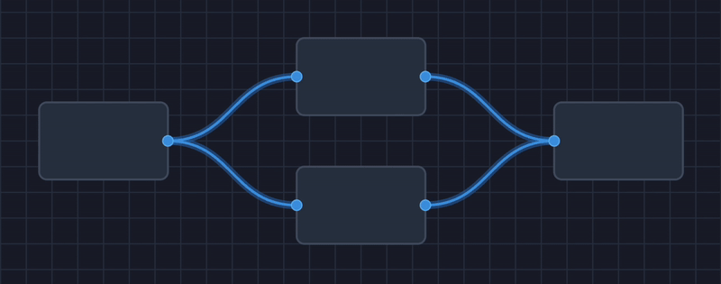
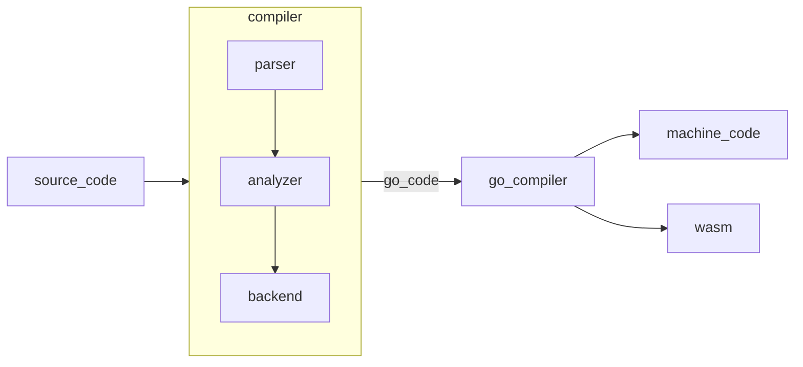

<div align="center">
  
</div>

<div align="center" style="display:grid;place-items:center;">

<h1>Neva Programming Language</h1>

<a href="https://trendshift.io/repositories/12825" target="_blank"></a>

[**Documentation**](./docs/README.md)
| [**Examples**](./examples/)
| [**Community**](#-community)
| [**Releases**](https://github.com/nevalang/neva/releases)
| [**Contributing**](./CONTRIBUTING.md)
| [**Architecture**](./ARCHITECTURE.md)

  [](https://goreportcard.com/report/github.com/nevalang/neva) [](https://discord.gg/dmXbC79UuH) [](https://chatgpt.com/g/g-RhZn00MXU-nevalang-expert)   [](https://opensource.org/licenses/MIT)

<p align="center">
  
</p>
</div>

## 🤔 What Is Nevalang?

> **⚠️ WARNING**: This project is under active development and not yet production-ready!

Neva is a new kind of programming language where instead of writing step-by-step instructions you create **networks** where data flows between **nodes** as immutable messages and everything runs in **parallel** by default. After type-checking, your program is compiled into **machine code** and can be distributed as a **single executable** with zero dependencies.

Combined with built-in **stream processing** support and features like **advanced error handling**, Nevalang is the perfect choice for **cloud-native applications** requiring **high concurrency**.

Future updates will include **visual programming** and **Go interoperability** to allow gradual adoption and leverage existing ecosystem.

### Why Yet Another Programming Language?

We created Nevalang because we saw a gap in the programming language landscape:

1. **Visual Programming Done Right** - While there are many visual programming tools, they're usually limited to specific domains or lack the power of traditional programming. Nevalang is designed from the ground up to be a hybrid visual/text-based programming environment.
2. **Simple Parallel Programming** - Most languages treat concurrency as an advanced feature, making it complex and error-prone. In Nevalang, parallelism is the default, and the language design prevents common issues like data races.
3. **Modern Developer Experience** - We combine the best ideas from modern languages with dataflow programming to create a unique development experience focused on productivity.

Finally, we believe exploring new programming paradigms is valuable for the entire programming community, even if only to learn what works and what doesn't.

## 👋 Hello, World!

```neva
import { fmt }

def Main(start any) (stop any) {
	println fmt.Println<string>
	---
	:start -> 'Hello, World!' -> println
	[println:res, println:err] -> :stop
}
```

What's happening here:

- `import { fmt }` loads the `fmt` package for printing
- `def Main` defines the main component with input port `start` and output port `stop` of type `any` (it's safe since it's only used as a signal)
- `:start -> 'Hello, World!' -> println` defines a connection that sends the string to `println` when the program starts
- The runtime sends a message to `Main:start` at startup and waits for `Main:stop` to terminate
- `[println:res, println:err] -> :stop` defines a connection that sends either println:res or println:err as the termination signal, depending on which case returned from println.
- As in Go, errors need to be handled. Removing `println:err` from this example would result in a compiler error.

## 🔥 Features

- **Dataflow Programming** - Write programs as message-passing graphs
- **Implicit Parallelism** - Everything is parallel by default, no async-await/threads/goroutines/etc.
- **Strong Static Typing** - Robust type system with generics and pattern-matching
- **Machine Code Compilation** - Compile for any Go-supported platform, including WASM
- **Stream Processing** - Handle real-time data with streams as first class citizens
- **Advanced Error Handling** - Errors as values with `?` operator to avoid boilerplate
- **Functional Patterns** - Immutability and higher-order components
- **Dependency Injection** - Modularity with interfaces and DI
- **Minimal Core** - Simple language with limited abstractions
- **Package Manager** - Publish packages by pushing a git-tag
- **Garbage Collection** - Automatic memory management using Go's low-latency GC
- **Visual Programming** (WIP): Edit programs as visual graphs
- **Go Interoperability** (WIP): Call Go from Neva and Neva from Go
- **NextGen Debugging** (WIP): Observe execution in realtime and intercept messages on the fly

## 🧐 Why Use Nevalang?

Let's compare Nevalang with Go. We could compare it to any language but Go is a simple reference since Nevalang is written in Go.

| **Feature**              | **Neva**                                                           | **Go**                                                                            |
| ------------------------ | ------------------------------------------------------------------ | --------------------------------------------------------------------------------- |
| **Paradigm**             | Dataflow - nodes send and receive messages through connections     | Control flow - execution moves through instructions step by step                  |
| **Concurrency**          | Implicit - everything is concurrent by default                     | Explicit - goroutines, channels, and mutexes                                      |
| **Error Handling**       | Errors as values with `?` operator to avoid boilerplate            | Errors as values with `if err != nil {}` boilerplate                              |
| **Mutability**           | Immutable - no variables and pointers; data races are not possible | Mutable - variables and pointers; programmer must avoid data races                |
| **Null Safety**          | Yes - nil pointer dereference is impossible                        | No - nil pointer dereference is possible                                          |
| **Zero Values**          | No zero values - everything must be explicitly initialized         | Zero values by default - everything can be initialized implicitly                 |
| **Subtyping**            | Structural - types are equal by their shape                        | Nominal - types are equal by their name                                           |
| **Traceback**            | Automatic - every message traces its path                          | Manual - programmer must explicitly wrap every error to add context               |
| **Dependency Injection** | Built-in - any component with dependency expects injection         | Manual - programmer must create constructor function that takes dependencies      |
| **Stream Processing**    | Native support with components like `Map/Filter/Reduce`            | Programmer must manually implement dataflow patterns with goroutines and channels |

## 🏭 Architecture

> This is a high-level overview. For a more detailed overview of the architecture, please see [ARCHITECTURE.md](./ARCHITECTURE.md)

<div align="center">



</div>

Nevalang compiles to dependency-free, human-readable Go code that uses goroutines and channels for message-passing with parallelism. The Go compiler then produces optimized platform-specific code for any supported platform. This approach gives our programs access to Go's production-grade runtime with an advanced scheduler, garbage collector, and battle-tested standard library. We stand on the shoulders of giants.

## ⭐️ Star History

<p align="center">
  <a href="https://star-history.com/#nevalang/neva&Timeline">
  <picture>
    <source media="(prefers-color-scheme: dark)" srcset="https://api.star-history.com/svg?repos=nevalang/neva&type=Timeline&theme=dark" />
    <source media="(prefers-color-scheme: light)" srcset="https://api.star-history.com/svg?repos=nevalang/neva&type=Timeline" />
    
  </picture>
  </a>
</p>

## 💭 What's Next?

> ℹ️ We take development seriously but have limited time to keep everything current. Feel free to reach out on our social platforms with any questions!

- [Documentation](./docs/README.md) - Install and learn the language basics
- [Examples](./examples/) - Learn the language by small programs

### Community

This is an ambitious project maintained by a small group of enthusiasts. Your support by **joining us** will show interest and motivate us to continue.

[](https://discord.gg/dmXbC79UuH)
[](https://t.me/+H1kRClL8ppI1MWJi)
[](https://www.reddit.com/r/nevalang/)
[](https://x.com/neva_language)

### Contributing

1. See [contributing](./CONTRIBUTING.md) and [architecture](./ARCHITECTURE.md)
2. Check out [roadmap](https://github.com/nevalang/neva/milestones?direction=asc&sort=due_date&state=open) and [kanban-board](https://github.com/orgs/nevalang/projects/2/views/3?filterQuery=)
3. Also please read our [CoC](./CODE_OF_CONDUCT.md)
4. Join [discord server](https://discord.gg/dmXbC79UuH)

### Support

Please **give us a star ⭐️** to increase our chances of getting into GitHub trends - the more attention Nevalang gets, the higher our chances of actually making a difference.

<p align="center">
  
</p>

Please **share this project** with your friends! Every share helps us reach more developers and grow our community. The more developers we reach, the more likely we are to build something truly revolutionary together. 🚀

<div align="center" style="display:grid;place-items:center;">

[](https://x.com/intent/tweet?text=Check%20out%20Nevalang%20on%20GitHub:%20https://github.com/nevalang/neva%20%23Programming%20%23DataFlow%20%23Concurrency)
[](https://www.facebook.com/sharer/sharer.php?u=https://github.com/nevalang/neva)
[](https://www.reddit.com/submit?title=Check%20out%20Nevalang%20on%20GitHub:%20https://github.com/nevalang/neva)
[](https://t.me/share/url?url=https://github.com/nevalang/neva&text=Check%20out%20Nevalang%20on%20GitHub)
[](https://wa.me/?text=Check%20out%20Nevalang%20on%20GitHub:%20https://github.com/nevalang/neva)
[](https://news.ycombinator.com/submitlink?u=https://github.com/nevalang/neva&t=Nevalang:%20Next-generation%20programming%20language%20with%20implicit%20parallelism)
[](https://www.linkedin.com/sharing/share-offsite/?url=https://github.com/nevalang/neva)

</div>
