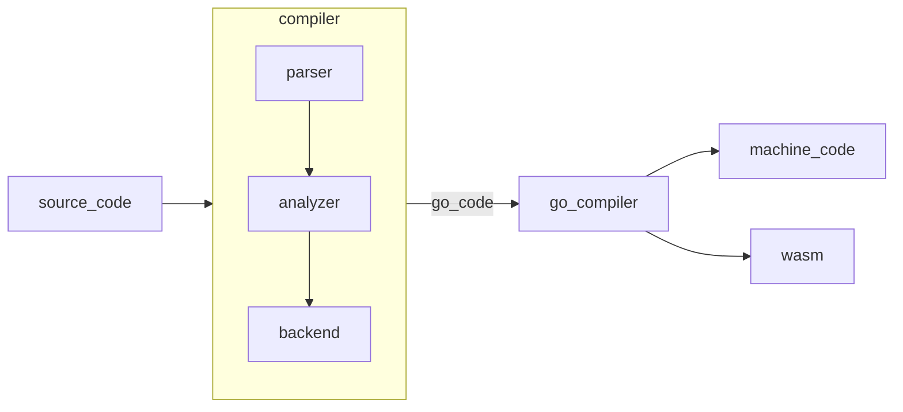
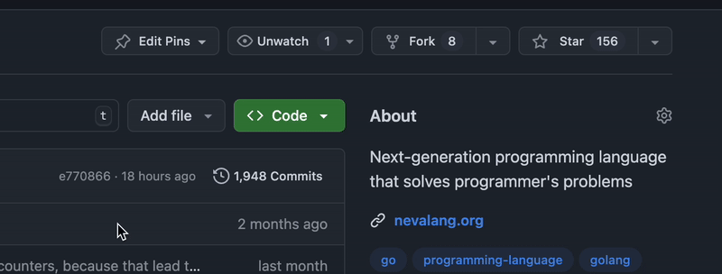

<div align="center">
  
</div>

<div align="center" style="display:grid;place-items:center;">

<h1>Neva Programming Language</h1>


[](https://goreportcard.com/report/github.com/nevalang/neva)

[](https://discord.gg/dmXbC79UuH)

[](https://opensource.org/licenses/MIT)

</div>

Neva is a statically typed, compiled dataflow programming language.

Instead of writing step-by-step instructions, you create networks of nodes that exchange messages through ports.

## Hello, World!

```neva
import {
  fmt
  runtime
}

def Main(start any) (stop any) {
	println fmt.Println
	panic runtime.Panic
	---
	:start -> 'Hello, World!' -> println:data
	println:res -> :stop
	println:err -> panic
}
```

This code imports fmt and runtime to use Println and Panic components, and defines Main with one input (start) and one output (stop). The two nodes are connected: when the program starts, 'hello world' is sent to println; if printing fails, errors go to panic; after printing, the program ends.

## Key Features

- **Flow-Based Runtime** - Everything runs in parallel by default
- **Hybrid Programming** (WIP) - Program both in text and visual editor
- **Powerful Compiler** - Strict static types and machine code compilation
- **Go Interop** - call Go code from Neva and vice versa for gradual adoption and reuse of the ecosystem
- **Modern Language Design** - errors as values, pattern matching, null safety, etc.
- And many more!

## Architecture

Neva compiles to clean, dependency-free Go code using goroutines and channels for message passing. The Go compiler then produces optimized binaries for any supported platform.

<div align="center">



</div>

## Why?

1. Controlflow paradigm is is well established while dataflow is underrepresented.
2. Existing visual tools lacks the expressiveness of traditional languages.
3. Many languages treat concurrency as an advanced feature, not the default.
4. Not many languages compiles to Go or interops with it, while it has state of the art runtime and standard library.

## Contributing

1. See [contributing](./CONTRIBUTING.md) and [architecture](./ARCHITECTURE.md)
2. Check out the [roadmap](https://github.com/nevalang/neva/milestones?direction=asc&sort=due_date&state=open)
3. Read our [CoC](./CODE_OF_CONDUCT.md)
4. Join [discord server](https://discord.gg/dmXbC79UuH) 👈

## Community

Your support by joining us will show interest and motivate us to continue.

[](https://discord.gg/dmXbC79UuH)
[](https://t.me/+H1kRClL8ppI1MWJi)
[](https://www.reddit.com/r/nevalang/)
[](https://x.com/neva_language)

## ⭐️ Star History

<p align="center">
  <a href="https://star-history.com/#nevalang/neva&Timeline">
  <picture>
    <source media="(prefers-color-scheme: dark)" srcset="https://api.star-history.com/svg?repos=nevalang/neva&type=Timeline&theme=dark" />
    <source media="(prefers-color-scheme: light)" srcset="https://api.star-history.com/svg?repos=nevalang/neva&type=Timeline" />
    
  </picture>
  </a>
</p>

## Support

Please give us a star ⭐️ to increase our chances of getting into GitHub trends. The more developers we reach, the more likely we are to build something truly revolutionary together. 🚀

<p align="center">
  
</p>

Every share helps us grow our community.

<div align="center" style="display:grid;place-items:center;">

[](https://x.com/intent/tweet?text=Check%20out%20Nevalang%20on%20GitHub:%20https://github.com/nevalang/neva%20%23Programming%20%23DataFlow%20%23Concurrency)
[](https://www.facebook.com/sharer/sharer.php?u=https://github.com/nevalang/neva)
[](https://www.reddit.com/submit?title=Check%20out%20Nevalang%20on%20GitHub:%20https://github.com/nevalang/neva)
[](https://t.me/share/url?url=https://github.com/nevalang/neva&text=Check%20out%20Nevalang%20on%20GitHub)
[](https://wa.me/?text=Check%20out%20Nevalang%20on%20GitHub:%20https://github.com/nevalang/neva)
[](https://news.ycombinator.com/submitlink?u=https://github.com/nevalang/neva&t=Nevalang:%20Next-generation%20programming%20language%20with%20implicit%20parallelism)
[](https://www.linkedin.com/sharing/share-offsite/?url=https://github.com/nevalang/neva)

</div>
