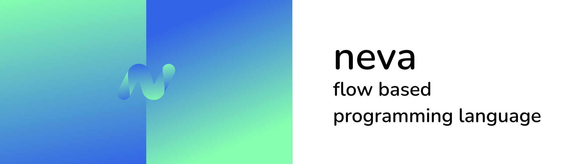

**<p align="center">Flow-Based Programming Language</p>**

 

> ⚠️ Warning: This project is currently under heavy development and is not yet ready for production use.

# Neva

A general-purpose flow-based programming language with static types and implicit parallelism. Compiles to machine code and Go.

Website: https://nevalang.org/

## Quick Start

### Download Neva CLI

For Mac OS and Linux:

```bash
curl -sSL https://raw.githubusercontent.com/nevalang/neva/main/scripts/install.sh | bash
```
if you device connected to China network:
```bash
curl -sSL https://raw.githubusercontent.com/nevalang/neva/main/scripts/install.sh | bash
```
For Windows (please note there's an WIP [issue](https://github.com/nevalang/neva/issues/499) with Windows Defender, try manual download from releases if installed won't work):

```batch
curl -o installer.bat -sSL https://raw.githubusercontent.com/nevalang/neva/main/scripts/install.bat && installer.bat
```

### Create test project

```bash
neva new test
cd test
```

Replace the code in `src/main.neva` with the following:

```neva
component Main(start) (stop) {
	nodes { Println<any> }
	net {
		:start -> ('Hello, World!' -> println)
		println -> :stop
	}
}
```

### Execute

Now run (make sure you are in created `test` directory with `neva.yml`):

```bash
neva run src
```

You should see the following output:

```bash
Hello, World!
```

[Learn how to generate native code or Go](https://nevalang.org/docs/quick-start)

## Features 🚀

- Flow-Based Programming
- Implicit Parallelism
- Strong Static Typing
- Multi-Target Compilation
- Clean C-like Syntax
- Interpreter Mode
- Builtin Dependency Injection
- Builtin Observability
- Package Management
- Garbage Collection

[Learn more about the language](https://nevalang.org/docs/about)

Please note that even though these features are technically implemented, **developer-experience may be bad** due to current project state. **No backward-compatibility** guarantees at the time.

## Roadmap (🚧 WIP)

Nevalang is at an extremely early stage but with the help of community it can become a feature-rich, mature language.

- Building a Community
- Core Standard Library
- Feature-Rich LSP-compatible Language Server
- Go Interop (import go from neva and neva from go)
- DAP-compatible Debugger
- Testing Framework
- No Runtime Exceptions (If it runs then it works)
- Visual Programming in VSCode (Nevalang becomes hybrid langauge)

[See backlog for more details](https://github.com/orgs/nevalang/projects)

Nevalang needs your help - it currently has only one maintainer.

## Community

Join community. **Together** we can change programming for the better:

- [Discord](https://discord.gg/dmXbC79UuH)
- [Reddit](https://www.reddit.com/r/nevalang/)
- [Telegram group](https://t.me/+H1kRClL8ppI1MWJi)
- [Telegram channel](https://t.me/+H1kRClL8ppI1MWJi)

## Contributing

See [CONTRIBUTING.md](./CONTRIBUTING.md) and [ARCHITECTURE.md](./ARCHITECTURE.md).

Neva is a relatively small and simple language compared to many other statically typed compiled languages out there. Don't be intimidated, feel free to dive in and hack around!

Please note that, due to the early stage of development, the documentation can sometimes be outdated. Please reach maintainer if you have questions.
