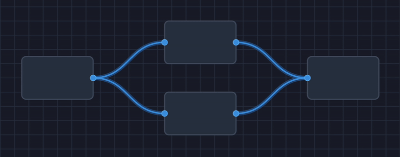
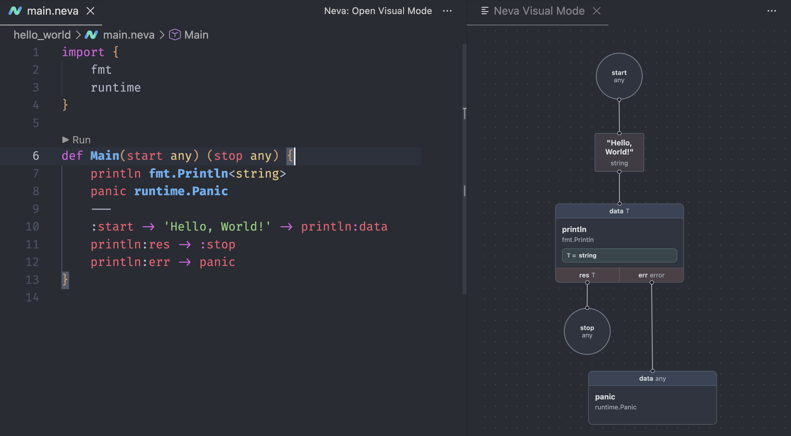

<p align="center">
  
</p>

<h1 align="center">Neva</h1>

<p align="center">
  A compiled, statically typed dataflow programming language.<br>
  Build programs as networks of components that exchange messages.
</p>

<p align="center">
  <a href="./docs/user/tutorial.md">Get started</a> ·
  <a href="./docs/user/README.md">Documentation</a> ·
  <a href="https://github.com/nevalang/neva/releases">Releases</a> ·
  <a href="https://discord.gg/dmXbC79UuH">Discord</a>
</p>

<p align="center">
  <a href="https://github.com/nevalang/neva/actions/workflows/test.yml"></a>
  <a href="https://github.com/nevalang/neva/actions/workflows/lint.yml"></a>
  <a href="https://goreportcard.com/report/github.com/nevalang/neva"></a>
  <a href="./LICENSE"></a>
</p>

<p align="center">
  
</p>

## Think in dataflow

Most languages describe a program as a sequence of instructions. Neva describes
it as a graph: components receive messages through input ports, do one job, and
send messages through output ports. Connections make both data dependencies and
concurrency explicit.

- **Concurrency by default.** Independent components run concurrently; order is
  introduced only where the graph requires it.
- **Static types, compiled binaries.** Neva compiles to dependency-free Go,
  then uses Go's toolchain for native binaries, WebAssembly, and cross-compilation.
- **No hidden control flow.** Routing, error handling, streams, and dependencies
  are visible as nodes and connections.

## One program, two views

Text is the source of truth: it is easy to version, review, and generate. The
same graph can also be inspected in Visual Mode, so the connections behind the
program stay visible instead of being buried in control flow.

<p align="center">
  
</p>

<p align="center"><em>Visual Mode is an early, read-only preview.</em></p>

## Get started

Install the CLI on macOS or Linux:

```sh
curl -sSL https://raw.githubusercontent.com/nevalang/neva/main/scripts/install.sh | bash
```

Then follow the [tutorial](./docs/user/tutorial.md) to create and run your
first program. Windows installation and building from source are documented
there as well.

## Why Neva?

Dataflow is a natural fit when a system is made of independent work: services,
pipelines, stream processing, integrations, and concurrent applications. Neva
makes that structure the language itself instead of an advanced library pattern.

It is inspired by flow-based programming and CSP, while deliberately keeping a
small textual language and a path toward visual programming. Go is its backend
and interoperability layer, so Neva can use Go's mature runtime and ecosystem.

## Learn more

- [Tutorial](./docs/user/tutorial.md) — installation, your first program, and core concepts
- [Language guide](./docs/user/README.md) — types, components, streams, and packages
- [Why dataflow?](./docs/user/vision.md) — the language direction and design goals
- [Neva and Go](./docs/user/comparison.md) — the differences in execution model and tooling
- [Developer guide](./docs/developer/README.md) — compiler, runtime, and contributing

## Contributing and community

Neva is open source under the [MIT License](./LICENSE). Contributions, design
discussion, and bug reports are welcome.

- Join [Discord](https://discord.gg/dmXbC79UuH) or the [Telegram group](https://t.me/+H1kRClL8ppI1MWJi)
- Read the [contributing guide](./docs/developer/contributing.md)
- Support the project on [Open Collective](https://opencollective.com/nevalang)
