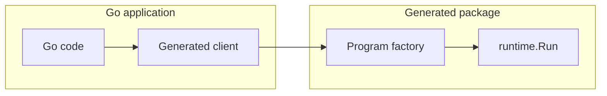

# Go → Neva Package Mode Design

## Goals & Constraints

* Generate Go packages that feel idiomatic to Go developers so Neva programs can be invoked from Go with the same ease as calling ordinary functions.
* Do not require changes to the Neva runtime or stdlib. All custom interop code must live in generated files or user packages.
* Reuse the existing Go backend so we continue to emit ready-to-run Go code without runtime unmarshalling or reflection.
* Keep performance overhead low by reusing `runtime.Program` execution semantics and avoiding extra goroutines.
* Leave room for future hooks (e.g. swapping the runtime implementation) without forcing that surface into the initial MVP.

This iteration deliberately focuses on **Go → Neva**. Calling user Go code from Neva will be revisited once the package flow proves out.

## Current Backend Behaviour

Running `neva build --target=go` today produces an executable:

1. The compiler builds IR for a single entry-point program and records the list of `FuncCall`s plus channel identifiers.
2. `tpl.go` renders `main.go`, wiring those calls into one `runtime.Program` literal with `Start`/`Stop` ports.
3. The backend copies `internal/runtime/**` and related support files next to the entry point so the emitted Go compiles in isolation.

Package mode keeps this pipeline but emits library-friendly files instead of a `main` package.

## CLI Surface

Package mode extends the existing command without inventing new boolean flags:

```bash
neva build --target=go --target-go-mode=pkg --output=./internal/gen ./pkg/echo
```

* `--target=go` continues to select the Go backend.
* `--target-go-mode` accepts `executable` (current default) or `pkg`.
* `--output` points to the directory where generated Go code is written.
* The final positional argument stays the path to the Neva **package** being compiled.

`go:generate` directives can reference the same command; the resulting files integrate with standard tooling like `goimports` and `go list`.

## Exported Component Handling

Executable builds assume one entry point. Library emission must surface every `pub def` exposed by the package. The compiler performs three extra steps when `--target-go-mode=pkg` is selected:

1. **Export discovery.** We already mark exported components in the IR. Package mode collects each export and records its inport/outport schemas.
2. **Wrapper synthesis.** For every export the backend fabricates a tiny IR program that maps the component’s public ports into the `Start`/`Stop` handshake expected by `runtime.Run`. Each wrapper:
   * Treats all input ports as the payload delivered on `Start`.
   * Treats output ports as the payload observed on `Stop`.
   * Rejects components lacking either inputs or outputs (they cannot be sensibly expressed as a call-return function). Support for more exotic shapes can be layered in later.
3. **Template reuse.** The existing Go template runs once per wrapper, producing a `runtime.Program` literal identical to what the executable backend would emit.

This design intentionally presents exported components as *call/return* style APIs to Go code while preserving dataflow inside the Neva program. It sacrifices direct streaming semantics for the first iteration but massively simplifies interop: the host submits one request, waits for one response, and can run multiple requests concurrently by creating independent runtimes.

## Example Program Factory

Generated factories create the same wiring as today’s executable template. The snippet below illustrates the shape for an exported `pub def Echo(request string) (response string)` component:

```go
package echo

import "github.com/nevalang/neva/internal/runtime"

type echoPorts struct {
    start *runtime.SingleOutport
    stop  *runtime.SingleInport
}

func newEchoProgram() (runtime.Program, echoPorts) {
    interceptor := runtime.ProdInterceptor{}

    startChan := make(chan runtime.OrderedMsg)
    stopChan := make(chan runtime.OrderedMsg)

    startPort := runtime.NewSingleOutport(
        runtime.PortAddr{Path: "in", Port: "start"},
        interceptor,
        startChan,
    )
    stopPort := runtime.NewSingleInport(
        stopChan,
        runtime.PortAddr{Path: "out", Port: "stop"},
        interceptor,
    )

    funcCalls := []runtime.FuncCall{
        {
            Ref: "user.echo",
            IO: runtime.IO{
                In: runtime.NewInports(map[string]runtime.Inport{
                    "request": runtime.NewInport(nil, runtime.NewSingleInport(
                        startChan,
                        runtime.PortAddr{Path: "in/user.echo", Port: "request"},
                        interceptor,
                    )),
                }),
                Out: runtime.NewOutports(map[string]runtime.Outport{
                    "response": runtime.NewOutport(
                        runtime.NewSingleOutport(
                            runtime.PortAddr{Path: "out/user.echo", Port: "response"},
                            interceptor,
                            stopChan,
                        ),
                        nil,
                    ),
                }),
            },
            Config: nil,
        },
    }

    prog := runtime.Program{
        Start:     startPort,
        Stop:      stopPort,
        FuncCalls: funcCalls,
    }

    return prog, echoPorts{start: startPort, stop: stopPort}
}
```

The host-facing client never touches channel wiring directly—it receives the `runtime.Program` and the typed port handles from helper functions like this one.

## Generated Package Layout

Given `--output=./internal/gen`, the backend emits a Go package rooted at `internal/gen/<pkgname>` plus the runtime copy it already ships today:

```
internal/gen/
  runtime/…                   # identical to executable mode
  echo/                       # <pkgname> matches filepath.Base(--output)
    doc.go                    # package documentation and go:generate hint
    client.go                 # public constructor + one method per exported component
    programs.go               # factories like newEchoProgram
    wiring.go                 # request/response structs + helpers
    types.go                  # Go representations of exported Neva types
```

All files start with the conventional `// Code generated by neva. DO NOT EDIT.` comment. Host code only imports `internal/gen/echo`; the runtime copy remains an implementation detail.

## Type Mapping Strategy

Neva types already lower to runtime messages for the executable target. Package mode reuses that knowledge to emit explicit Go types:

* Simple scalars (`bool`, `int`, `float`, `string`) map to Go built-ins.
* Tuples and records become structs with exported fields mirroring port names.
* Lists map to slices of the element type.
* Unions map to Go `struct` wrappers that carry both the active variant tag and the payload.

When the type system expresses shapes we cannot yet model (e.g. generics), the generator can fall back to `runtime.Msg` fields for the MVP, documenting the lossy conversion. The important piece is that the request/response structs used by the client and wiring helpers are generated from the same schema the runtime uses, keeping the API type-safe where possible.

## Go → Neva Workflow

### Step-by-step

1. **Generate the package.** Run `neva build --target=go --target-go-mode=pkg --output=./internal/gen ./pkg/echo`.
2. **Import the client.** In Go code: `import "example.com/app/internal/gen/echo"`.
3. **Construct a client.** `client, err := echo.NewClient()`.
4. **Call an export.** `resp, err := client.Echo(ctx, echo.EchoRequest{Request: "hi"})`.
5. **Handle the result.** The response struct mirrors the Neva outports.

### Client snippet

```go
package echo

import (
    "context"

    "github.com/nevalang/neva/internal/runtime"
    "github.com/nevalang/neva/internal/runtime/funcs"
)

type Client struct {
    registry map[string]runtime.FuncCreator
}

func NewClient() *Client {
    return &Client{registry: funcs.NewRegistry()}
}

func (c *Client) Echo(ctx context.Context, req EchoRequest) (EchoResponse, error) {
    prog, ports := newEchoProgram()

    go func() {
        _ = sendEchoRequest(ctx, ports.start, req)
    }()

    errCh := make(chan error, 1)
    go func() {
        errCh <- runtime.Run(ctx, prog, c.registry)
    }()

    resp, err := receiveEchoResponse(ctx, ports.stop)
    if err != nil {
        return EchoResponse{}, err
    }

    if runErr := <-errCh; runErr != nil {
        return EchoResponse{}, runErr
    }

    return resp, nil
}
```

`sendEchoRequest` and `receiveEchoResponse` live in `wiring.go`. They convert between the typed request/response structs and `runtime.Msg` values before placing them on the start/stop ports. A later iteration can add constructors such as `NewClientWithRuntime` without breaking the simple default shown here.

### Mermaid overview



## Limitations & Trade-offs

* Exported components behave like RPC endpoints: the host waits for completion before receiving a response. Streaming between Go and Neva is not directly exposed yet.
* Each invocation spins up its own program instance. Sharing a runtime across multiple calls is possible later by adding constructors such as `NewClientWithRuntime`, but the MVP keeps the API simple.
* Components must currently expose at least one inport and one outport. Support for sink/source shapes can be added once we define the expected Go-side semantics.

## Implementation Plan

1. **CLI plumbing.** Add the `pkg` mode flag parsing while leaving executable behaviour untouched.
2. **Export collection.** Thread export metadata through the Go backend entry point.
3. **Wrapper generation.** Synthesize wrapper programs and reuse `tpl.go` to materialise the `runtime.Program` literals.
4. **Template additions.** Introduce library templates for `client.go`, `programs.go`, `wiring.go`, and `types.go` that consume the existing `templateData`.
5. **Type emitter.** Reuse the current type lowering logic to populate the request/response structs.
6. **End-to-end tests.** Generate a package from a sample Neva project, `go build` it, and execute a smoke test that calls the exported component from Go.

## Performance & Tooling Notes

* No runtime unmarshalling is performed; generated code sends `runtime.Msg` values straight over the compiled channels.
* The client API mirrors conventional Go constructors and leaves room to add `NewClientWithRuntime` later without breaking callers.
* The output tree is a normal Go package, so `go mod tidy`, `go test`, and IDE integrations behave as expected.
