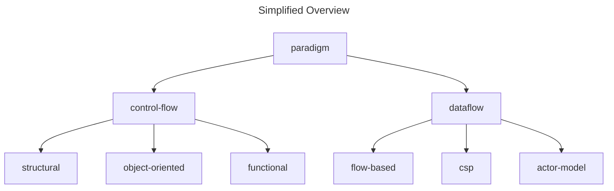

# Terminology

This document explains key terms used throughout the documentation and how they are applied.

## Paradigm

A programming paradigm is a set of abstractions that describe computation and form a hierarchical tree of different approaches.

## Control-Flow

Control-flow is a top-level paradigm that describes computation as a series of steps that are executed sequentially.

## Dataflow

Dataflow is a top-level paradigm that describes computation as a network of nodes that perform message-passing.
