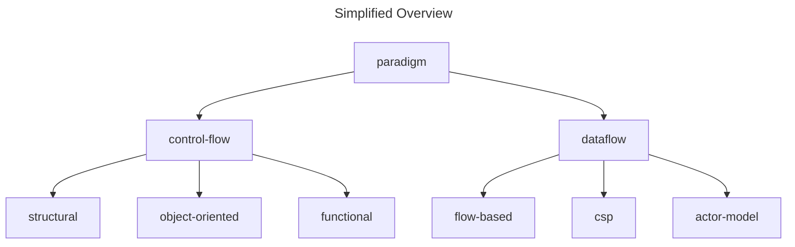

# Terminology

This document explains key terms used throughout the documentation and how they are applied.

## Paradigm

A programming paradigm is a set of abstractions that describe computation and form a hierarchical tree of different approaches.

## Pure/Mixed Paradigm

Mixed paradigm combines control-flow and dataflow approaches. C is pure control-flow, Neva is pure dataflow, while Go mixes both.

## Control-Flow

Control-flow is a top-level paradigm that describes computation as a series of steps that are executed sequentially. Also control-flow might mean set of instructions.

## Dataflow

Dataflow is a top-level paradigm that describes computation as a network of nodes that perform message-passing. Also dataflow might mean topology of the network.

## Synchronous / Sequential Execution

Synchronous execution is when events occur in a strict sequential order, where each event must complete before the next one begins. Sequential execution means the same.

## Concurrent / Parallel Execution

Concurrent execution is when multiple events can occur independently without waiting for each other. Parallel means specifically when there's capacity for multi-core processing.

## Race Condition / Out-of-Order

Race-condition is a problem of concurrent programming when events are processed out of order.

## Deadlock

Deadlock is a problem of concurrent programming when not a single event can happen because all possible events are blocked onto each other in some way

