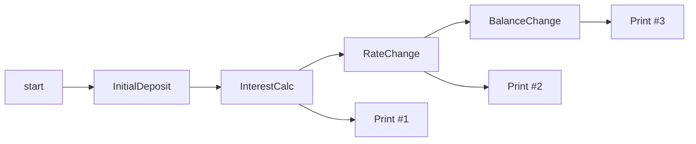

# AGENTS.md

This example models account state updates in three sequential steps:

1. initial deposit
2. interest with a rate change
3. interest with a balance change

```mermaid
flowchart LR
    start["start"] --> init["InitialDeposit"]
    init --> calc["InterestCalc"]
    calc --> rate["RateChange"]
    rate --> balance["BalanceChange"]

    calc --> p1["Print #1"]
    rate --> p2["Print #2"]
    balance --> p3["Print #3"]
```
