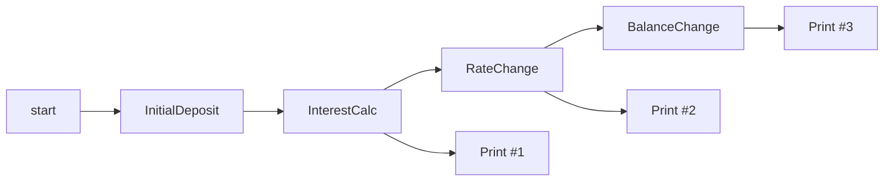

# interest_pipe

This example models an account state that is updated in three sequential steps:
initial deposit, interest with a rate change, and interest with a balance change.

Expected printed values:
- `5000` for `5 * 1000 * (1-0)` after initial deposit.
- `5000` for `5 * 1000 * (2-1)` before rate update applies to future intervals.
- `6000` for `6 * 1000 * (3-2)` after rate update.
