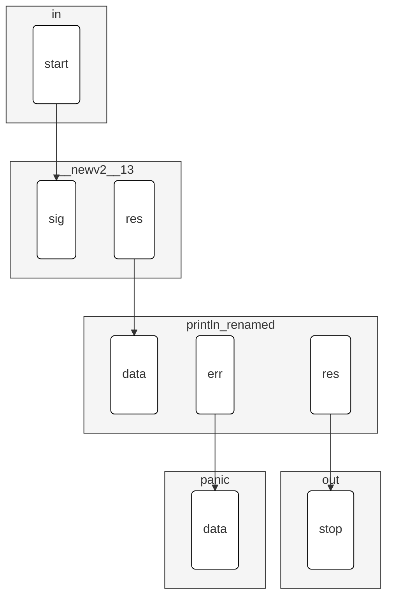

# Program: hello_world

**Compiler:** 0.32.0

## 1. Visual Flow

## 2. Components

| Node | Ref | Config | Ports |
| :--- | :--- | :--- | :--- |
| `__newv2__13` | `new_v2` | `"Hello, World!"` | `in:sig, out:res` |
| `in` | - | - | `out:start` |
| `out` | - | - | `in:stop` |
| `panic` | `panic` | - | `in:data` |
| `println_renamed` | `println` | - | `in:data, out:err, out:res` |

## 3. Metrics
* **Nodes:** 5
* **Connections:** 4
