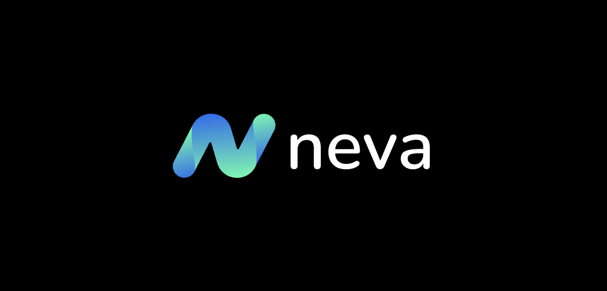
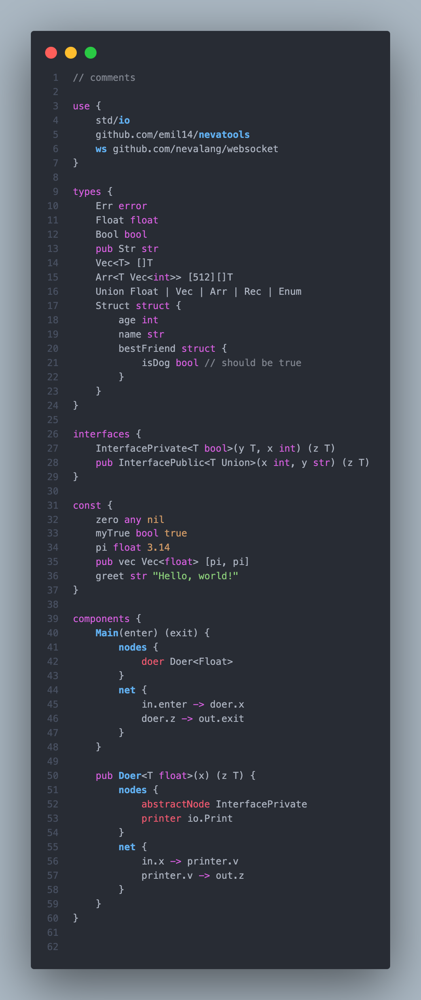

# Neva Programming Language

This is extension for [Neva](https://github.com/nevalang/neva) - flow based programming language.

Please note that you need to have `neva.yaml` in the root of your workspace to activate extension.

## Requirements

- [Neva](https://github.com/nevalang/neva) programming language installed

## Features

### Syntax Highlighting

### Error messages (Diagnostics)

Error messages occur as you type in _problems_ panel

## Contributing

See [./Contributing.md](Contributing.md)

## Release Notes

### 0.3.0

- Web-view temporary removed after massive rewriting of the language
- Updated syntax highlighting to match **new grammar**
- Updated icons for command menu and files
- Updated header with **new logo**

### 0.2.0

- **LSP**-compatible **Language Server**
- **WebView**-based **Custom editor** for visual editing of `.neva` files

### 0.1.0

- First release with textmate (regexp) based **syntax highlighting**.
